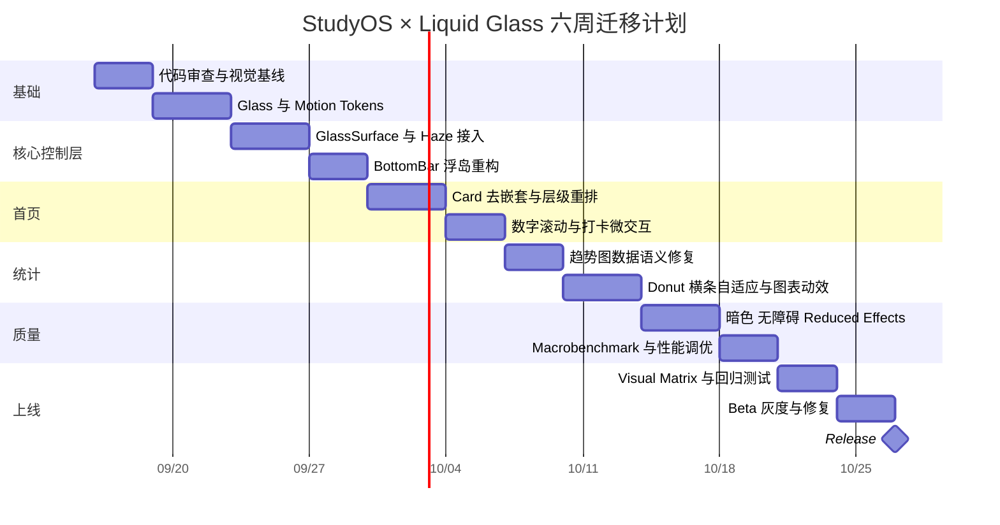

# StudyOS × Liquid Glass 前端改造深度研究报告

## 执行摘要

我已按你截图中的唯一界面文案定位并审查了实际 GitHub 仓库 **`xinye1017/yanji`**。它并不是 React / React Native / Flutter，而是 **原生 Android：Kotlin + Jetpack Compose + Material 3**；当前仓库已经具备主题 Token、暗色模式、ViewModel + StateFlow、Compose UI 测试、CI 质量门禁，以及一套名为 `GlassBottomBar` 的自定义浮动底栏，因此这次不需要推倒重写，最合适的是做一次**设计系统层面的增量重构**。fileciteturn5file0L2-L2 fileciteturn13file0L2-L2

当前最大问题也和你截图中的直觉一致：**“玻璃”目前主要是半透明渐变、边框和阴影，而不是背景内容参与的 backdrop blur；同时 `YanjiCard` 的全局默认策略使大量信息都进入圆角白卡，导致内容层和交互层权重相近。** Apple 在 WWDC25 对 Liquid Glass 的原则恰好相反：Glass 应优先成为浮在内容之上的导航/控制“功能层”，而内容层应尽量安静，层级更多通过布局与分组而非不断添加背景和边框表达。fileciteturn9file0L2-L2 fileciteturn14file0L2-L2 citeturn9view0turn9view2turn9view5

建议不要先做全页面“毛玻璃化”，而是按 **Design Tokens → Glass primitive → Bottom navigation → Home hierarchy → Stats visualization → Motion/A11y/Performance** 的顺序推进。这样既能最快出现明显视觉提升，又能控制 Compose 模糊效果对中低端 Android 设备的 GPU 成本。真正的 backdrop blur 建议采用 **Haze 1.7.3 稳定版**，而不是直接拿 Compose 自带 `Modifier.blur()` 冒充，因为当前 Compose 的 blur 针对的是组件自己的像素，不是后方内容。fileciteturn25file0L2-L2 citeturn14search0

**可以立即执行的首个任务清单：**

- [ ] 建立 `theme/LiquidGlassTokens.kt` 和 `ui/components/GlassSurface.kt`，把透明度、blur、边缘高光、暗色 Glass、motion 参数从 `GlassBottomBar.kt` 中抽出。
- [ ] 重构 `GlassBottomBar.kt`，接入真实 backdrop blur，并让 `MainNavigation()` 的内容成为 blur source；保持现有 5 Tab、测试 Tag 和导航业务逻辑不变。
- [ ] 重构 `YanjiCard.kt` 与首页 `CheckInCard.kt`：引入 `ContentSection / SurfaceCard / GlassControl` 三类 Surface，第一轮先消除首页最明显的“卡片套卡片”。

## 仓库现状与关键代码定位

### 技术基线

本次分析以仓库当前 `main` 分支、2026-09-15 的代码状态为基线。工程使用 Android Gradle Plugin、Kotlin、Jetpack Compose 与 Material 3；`compileSdk/targetSdk` 为 36，`minSdk` 为 24，Java/Kotlin toolchain 为 17。Release 已启用 R8 与资源 shrink，说明生产构建基础本身是合格的，不应为了视觉重构更换技术栈。fileciteturn5file0L2-L2

版本目录当前包含 Kotlin `2.3.20`、Compose BOM `2026.03.01`、Room `2.8.4`、Navigation 3 `1.0.1`、Coroutines `1.10.2`、Phosphor Icons `1.0.0` 等；这些依赖已经足够支撑绝大多数“StudyOS × Liquid Glass”重构，真正需要新增的核心第三方依赖实际上只有 backdrop blur。fileciteturn6file0L2-L2

仓库本身已经建立 `.github`、`app`、`scripts`、`DESIGN.md` 等工程结构，并且存在 Android CI、API Matrix、Release 等工作流，所以建议把这次视觉改造继续纳入现有工程规范，而不是建立第二套前端目录或独立 Design System 工程。fileciteturn3file0L1-L2

### 关键文件地图

| 职责 | 当前关键位置 | 审查结论 |
|---|---|---|
| 应用入口/路由 | `app/src/main/java/com/example/yanji/Navigation.kt` | 当前是 `YanjiTab + YanjiSubScreen + SnapshotStateList` 手工栈；业务逻辑清晰，但文件会随页面增长继续膨胀。fileciteturn11file0L2-L2 |
| 底部导航 | `ui/navigation/GlassBottomBar.kt` | 已有响应式浮岛、spring indicator、选中态动画和 a11y semantics；“Glass”主要仍由 alpha gradient + border + shadow 模拟。fileciteturn9file0L2-L2 |
| 全局主题 | `theme/Theme.kt` | 已有完整 Light/Dark ColorScheme、Shapes、主题持久化与额外主题 CompositionLocal，是此次重构非常好的基础。fileciteturn13file0L2-L2 |
| 色彩 | `theme/Color.kt` / `ExtraColors.kt` | 已有品牌蓝、紫、状态色及暗色额外色，可扩展而不需另起主题系统。fileciteturn12file4L53-L64 fileciteturn12file5L66-L77 |
| 圆角/间距 | `theme/Radius.kt` / `Spacing.kt` | 已 Token 化，但局部 Screen 仍存在 `10.dp/14.dp/18.dp/20.dp` 等裸值。fileciteturn12file0L1-L12 fileciteturn12file2L27-L38 |
| 通用卡片 | `ui/components/YanjiCard.kt` | `Hero/Standard/Compact` 三档圆角做得不错；问题在于默认所有 Card 都带 Surface + 1dp 边缘，容易诱导“万物卡片化”。fileciteturn14file0L2-L2 |
| 首页 | `ui/home/HomeScreen.kt` | 倒计时、打卡、今日学习、模考都以 Card 为主要容器；存在视觉权重均匀的问题。fileciteturn15file0L2-L2 |
| 首页状态 | `ui/home/HomeViewModel.kt` | 不可变 UiState + `combine()` + `stateIn(WhileSubscribed)`，派生数据已主动移出 UI；建议保留，不需要引入 Redux/MVI 框架。fileciteturn21file0L2-L2 |
| 每日打卡 | `ui/components/CheckInCard.kt` | 外层 Card 内又有 `background` 信息条，是截图中明显“卡套卡”的源码来源之一。fileciteturn36file0L2-L2 |
| 统计入口 | `ui/stats/StatsScreen.kt` | Range Selector、Hero、趋势图、分布图、3 Metric Cards、AI Card 顺序明确，但容器过多。fileciteturn16file0L2-L2 |
| 趋势图 | `ui/stats/StatsTrendChart.kt` | Compose Canvas 手写 Bar/Line；无第三方图表依赖，适合继续定制。fileciteturn18file0L2-L2 |
| 科目分布 | `ui/stats/SubjectDistributionCard.kt` | 同时展示 Donut、总分布条、逐项 Progress，信息表达重复；单科 100% 仍绘制 Donut。fileciteturn20file0L2-L2 |
| 图标 | Gradle + Phosphor | 主导航已使用 Phosphor Fill/Regular，统一性较好。fileciteturn11file0L2-L2 |
| IP/吉祥物 | `ui/components/JuanjuanMascot.kt` | 卷卷已是独立 Compose 组件，并在聊天、统计、考试等模块复用；不需要改成图片资产。fileciteturn34file0L1-L12 |
| 单元/契约测试 | `app/src/test/.../UiDesignSystemContractTest.kt` | 已对 Radius、Spacing、暗色、Detail TopBar、BottomBar 响应式做架构守卫。fileciteturn24file0L2-L2 |
| UI 测试 | `app/src/androidTest/.../DesignSystemVisualMatrixInstrumentedTest.kt` | 已覆盖 360/390/412dp、暗色与 1.3x Font Scale，是这次重构可直接扩展的测试基础。fileciteturn31file0L2-L2 |
| CI | `.github/workflows/android-quality.yml` | 已执行 Token Guard、Unit、Lint、Debug/Release Build 和 Emulator Instrumented Tests。fileciteturn33file0L2-L2 |

这里最值得强调的一点是：**这个仓库已经不是“架构烂掉后靠换 UI 框架救”的项目。** 相反，它的状态管理、主题、测试和 CI 都有相当不错的基础。真正拖住观感的是 Surface 分层、动态材质和 Motion System，而不是 Kotlin/Compose 本身。fileciteturn13file0L2-L2 fileciteturn21file0L2-L2 fileciteturn33file0L2-L2

## 设计原则与问题优先级

### StudyOS × Liquid Glass 应该如何翻译到 Android

这里不应做“仿 iOS 26 皮肤”，而应该抽取 Liquid Glass 的**设计原理**。

Apple 把 Liquid Glass 定义成一个浮在内容之上的独立功能层，尤其服务于 controls 与 navigation；它通过 lensing、透明度、阴影、环境适应和有机运动体现自身，而不是单纯把白色背景改成 `alpha = 0.7`。Apple 也明确建议不要把 Glass 大面积放到内容层、不要 Glass 套 Glass，材质应直接应用在 control 上而不是 control 的内部子 View。citeturn9view3turn9view5turn9view2

因此 StudyOS 建议采用三层模型：

```text
┌─────────────────────────────────────┐
│  Glass Interaction Layer            │
│  Bottom Dock / Segmented / AI Orb   │
├─────────────────────────────────────┤
│  Elevated Content Surface           │
│  今日学习 / 核心统计 / 需要边界的模块   │
├─────────────────────────────────────┤
│  Base Content Canvas                │
│  文本 / 打卡日历 / 列表 / 普通指标      │
└─────────────────────────────────────┘
```

这恰好解决你截图中“每一个区域都是白色圆角框”的问题。Apple 在 WWDC25 明确提出，新的层级应更多通过 **layout 和 grouping** 表达，而不是继续依赖额外背景、边框和装饰。citeturn9view0turn9view1

### 问题优先级矩阵

| 优先级 | 问题 | 视觉 | 交互 | 性能 | 可维护性 | 依据 |
|---|---|---:|---:|---:|---:|---|
| **P0** | `GlassBottomBar` 没有真正 backdrop blur | 高 | 高 | 中 | 中 | 当前实现主要是透明 gradient/border/shadow。fileciteturn9file0L2-L2 |
| **P0** | `YanjiCard` 默认所有内容都成为有边界 Surface | 高 | 中 | 低 | 高 | 全局 Card primitive 默认 Surface + Border，使多个模块视觉权重接近。fileciteturn14file0L2-L2 |
| **P0** | 趋势图将 0 学习时长强制 `coerceIn(0.06f, 1f)` | 高 | 中 | 低 | 中 | 0 数据仍产生约 6% 高度的“数据柱”，这不只是审美问题，也会误导数据阅读。fileciteturn18file0L2-L2 |
| **P0** | 图表固定最低 `maxBarDuration = 36000L` | 中 | 中 | 低 | 中 | 相当于固定至少用 10h 作为纵轴最大值，弱学习日会被视觉压缩。fileciteturn18file0L2-L2 |
| **P1** | 单科 100% 仍绘制巨大 Donut，再重复显示横条和进度条 | 高 | 中 | 中 | 中 | `SubjectDistributionCard` 同时有 3 种分布表达。fileciteturn20file0L2-L2 |
| **P1** | 首页倒计时、打卡、今日学习、模考几乎都是 Card | 高 | 中 | 低 | 中 | 缺乏主次节奏。fileciteturn15file0L2-L2 |
| **P1** | Time Range / Subject Level / Trend Mode 各自手写 Segmented Control | 中 | 中 | 低 | 高 | 同一交互模型散落在多个统计组件。fileciteturn16file0L2-L2 fileciteturn20file0L2-L2 |
| **P1** | Motion 参数散落 | 中 | 高 | 中 | 高 | BottomBar 已有 spring，但 Donut 是单独 tween，其余状态切换缺乏统一 Motion Token。fileciteturn9file0L2-L2 fileciteturn20file0L2-L2 |
| **P1** | `Navigation.kt` 手工维护越来越大的 `when` 页面树 | 低 | 中 | 低 | 高 | 已引入 Navigation 3 依赖但顶层仍是自建栈。fileciteturn11file0L2-L2 fileciteturn6file0L2-L2 |
| **P2** | 页面仍有较多裸 `dp/sp` | 中 | 低 | 低 | 高 | 已有 Token 系统，却没有完全贯彻。fileciteturn15file0L2-L2 fileciteturn36file0L2-L2 |
| **P2** | 微交互动效不足 | 中 | 高 | 中 | 中 | 核心数据更新、打卡、图表形态切换仍可更连贯。fileciteturn20file0L2-L2 |
| **P2** | 缺少真实帧性能基线 | 低 | 中 | 高 | 中 | CI 已有功能测试，但当前质量门没有 Macrobenchmark/Baseline Profile 性能门。fileciteturn33file0L2-L2 |

一个特别值得先修的细节是趋势图。截图里周一、周三～周日那些很短的“横条”，源码里并不是 Track，而是：

```kotlin
val ratio = (...).coerceIn(0.06f, 1f)
```

所以即使 `durationSeconds == 0L`，仍会被画成非零高度。fileciteturn18file0L2-L2

应改成：

```kotlin
val ratio = if (day.durationSeconds == 0L) {
    0f
} else {
    (day.durationSeconds.toFloat() / scaleMax)
        .coerceIn(0.08f, 1f)
}
```

然后**单独绘制很淡的 Track** 表示日期槽位。这样“没有学习”和“学得很少”不会被混为一谈。

## 代码级改造方案

### 建立真正的 Glass Design Tokens

建议新增：

```text
app/src/main/java/com/example/yanji/
└── theme/
    ├── LiquidGlassTokens.kt
    └── Motion.kt
```

当前 `Theme.kt` 已经有 `LocalYanjiDarkTheme` 和 `LocalYanjiExtraColors`，因此新的 Glass Token 应继续使用 CompositionLocal，而不是在 `GlassBottomBar`、Segmented Control、AI Orb 里分别写 alpha 和 blur radius。fileciteturn13file0L2-L2

建议 Token 第一版：

```kotlin
// theme/LiquidGlassTokens.kt
@Immutable
data class LiquidGlassTokens(
    val blurRadius: Dp,
    val tintAlpha: Float,
    val borderAlpha: Float,
    val highlightAlpha: Float,
    val noiseFactor: Float,
)

val LightGlass = LiquidGlassTokens(
    22.dp, .58f, .42f, .72f, .04f
)

val DarkGlass = LiquidGlassTokens(
    24.dp, .68f, .18f, .28f, .05f
)
```

这里的数值不是 Apple API 参数的照搬，而应该作为 StudyOS 自己的可调 Design Token。Apple 的真正 Liquid Glass 会根据底层内容、尺寸和环境动态改变 tint、shadow 与对比度，因此 Android 侧最好把这些值集中管理，避免“每个组件各自猜一个透明度”。citeturn9view5turn9view4

### Glass Material：真实 backdrop blur + 半透明 + 高光边

**推荐新增依赖：**

```toml
# gradle/libs.versions.toml
[versions]
haze = "1.7.3"

[libraries]
haze = { module = "dev.chrisbanes.haze:haze", version.ref = "haze" }
```

截至本次审查，Haze 最新稳定 Release 为 `1.7.3`；2.x 已存在预发布 API，但对生产 UI 重构我建议先用稳定 1.x，不要把一轮设计改造和一轮 effect-engine 大版本迁移叠加。fileciteturn25file0L2-L2

尤其不要把 `Modifier.blur(22.dp)` 直接加到 BottomBar 上：这会模糊 BottomBar 自己的图标/文字，而不是后面的学习内容。Haze 作者在 2026-09-13 针对 Compose 新 blur API 的说明也明确区分了 foreground blur 与 backdrop blur。citeturn14search0

新增：

```text
ui/components/GlassSurface.kt
```

示例实现，不超过 30 行：

```kotlin
@Composable
fun GlassSurface(
    hazeState: HazeState,
    modifier: Modifier = Modifier,
    shape: Shape = RoundedCornerShape(28.dp),
    content: @Composable BoxScope.() -> Unit,
) {
    val dark = yanjiIsDarkTheme()
    val tint = MaterialTheme.colorScheme.surface.copy(
        alpha = if (dark) .68f else .56f
    )
    Box(
        modifier
            .clip(shape)
            .hazeEffect(state = hazeState) {
                blurRadius = 22.dp
                tints = listOf(HazeTint(tint))
                noiseFactor = .04f
            }
            .border(
                1.dp,
                Color.White.copy(alpha = if (dark) .16f else .48f),
                shape
            ),
        content = content
    )
}
```

Haze 1.7 的 API 提供 `hazeSource`、`hazeEffect`、`blurRadius`、`tints`、`noiseFactor` 等能力，适合把真正参与绘制的背景输入交给浮动控件。fileciteturn29file0L2-L2

随后修改 `Navigation.kt`：

```kotlin
@Composable
fun MainNavigation() {
    val hazeState = rememberHazeState()

    Box(Modifier.fillMaxSize()) {
        Box(
            Modifier
                .fillMaxSize()
                .hazeSource(hazeState)
        ) {
            MainContent()
        }

        if (showBottomBar) {
            GlassBottomBar(
                hazeState = hazeState,
                modifier = Modifier.align(Alignment.BottomCenter)
            )
        }
    }
}
```

这才真正形成：

**content → backdrop capture → glass controls**

而不是：

**opaque content → 半透明白条盖上去**。

这也更接近 Apple 描述的“controls/navigation 形成一个浮在 content 上的独立 functional layer”。citeturn9view2turn9view5

### 悬浮导航浮岛

现有 `GlassBottomBar.kt` 不需要重写。它已经拥有几个值得保留的优点：响应式 260～360dp 宽度、44dp 选中 Indicator、spring 位移、Tab semantics、`minimumInteractiveComponentSize()` 与测试 Tag。fileciteturn9file0L2-L2 fileciteturn24file0L2-L2

应只替换“材质层”，保持“行为层”。

结构调整成：

```kotlin
GlassSurface(
    hazeState = hazeState,
    modifier = Modifier
        .width(dockWidth)
        .height(60.dp)
        .navigationBarsPadding(),
    shape = RoundedCornerShape(30.dp)
) {
    Row(Modifier.fillMaxSize()) {
        YanjiTab.entries.forEachIndexed { index, tab ->
            BottomTab(
                tab = tab,
                selected = currentTab == tab,
                modifier = Modifier.weight(1f),
                onClick = { onTabSelected(tab) }
            )
        }
    }
}
```

选中态建议继续有“液滴”，但降低白色实体圆的存在感：

```text
当前：
大白圆 + 蓝图标 + Glass Dock

建议：
Glass Dock
 └─ 柔和 tinted lens
     └─ Selected icon
```

Apple 对新 Tab Bar 的做法同样是让它浮在内容之上，并可在滚动时减少占用，以把注意力还给内容。citeturn8search9

第二阶段可增加滚动收缩。首页/统计改成 `LazyColumn` 后：

```kotlin
val compact by remember {
    derivedStateOf {
        listState.firstVisibleItemIndex > 0 ||
        listState.firstVisibleItemScrollOffset > 48
    }
}

val dockScale by animateFloatAsState(
    if (compact) .92f else 1f,
    spring(dampingRatio = .86f, stiffness = 420f)
)
```

注意不要根据每一个滚动像素触发复杂组合树重组。Android 官方 Compose 性能指南明确建议对这种滚动派生状态使用 `derivedStateOf`，并尽量延迟频繁状态读取。citeturn11search0

### 数字滚动过渡

首页 `3h 17m`、倒计时 `96`、统计累计时长非常适合成为 StudyOS 的视觉识别点。

新增：

```text
ui/components/RollingNumber.kt
```

```kotlin
@Composable
fun RollingNumber(
    value: Int,
    modifier: Modifier = Modifier
) {
    var previous by remember { mutableIntStateOf(value) }
    val up = value >= previous

    AnimatedContent(
        targetState = value,
        modifier = modifier,
        transitionSpec = {
            val enter = slideInVertically { if (up) it else -it } + fadeIn()
            val exit = slideOutVertically { if (up) -it else it } + fadeOut()
            enter togetherWith exit
        },
        label = "rollingNumber"
    ) { number ->
        Text(number.toString(), style = MaterialTheme.typography.displayMedium)
    }

    SideEffect { previous = value }
}
```

Compose 官方推荐 `AnimatedContent` 用于不同内容状态间过渡，因此这里没必要引入动画库。citeturn11search1

对于 `3h 17m`，更高级的做法是拆为：

```text
RollingNumber(3) + "h" + RollingNumber(17) + "m"
```

而不是让整个字符串一起滑走。

### 卡片去嵌套化

这里是首页提升高级感的第二大杠杆。

目前 `YanjiCard` 的默认行为就是 Surface + Border；`CheckInCard` 又在这个 Surface 内放了一张 `background(MaterialTheme.colorScheme.background)` 的可点击区域，因此截图会自然出现“白卡里又一张灰卡”。fileciteturn14file0L2-L2 fileciteturn36file0L2-L2

建议不要继续增加 `YanjiCardVariant.Flat`，而是语义拆分：

```text
YanjiSection          内容分组，无独立表面
YanjiSurfaceCard      真正需要边界的内容 Surface
GlassSurface          导航/控制 Surface
```

示例：

```kotlin
@Composable
fun YanjiSection(
    modifier: Modifier = Modifier,
    content: @Composable ColumnScope.() -> Unit
) {
    Column(
        modifier = modifier
            .fillMaxWidth()
            .padding(vertical = YanjiSpacing.ItemGap),
        content = content
    )
}

@Composable
fun YanjiSurfaceCard(
    modifier: Modifier = Modifier,
    content: @Composable ColumnScope.() -> Unit
) {
    YanjiCard(
        modifier = modifier,
        border = null,
        elevation = CardDefaults.cardElevation(0.dp),
        content = content
    )
}
```

首页建议变成：

```text
CountdownHero            Surface，但更轻
CheckInSection           无外卡
TodayStudyHero           主 Surface
ExamEntry                无外卡或超轻 Surface
Juanjuan                 情境式内容
FloatingBottomNavigation Glass
```

Apple 对 Liquid Glass 的指导明确建议在采用新设计语言时清理不必要的额外背景和边框，让 hierarchy 主要来自布局与 grouping。citeturn9view0turn9view1

`CheckInCard.kt` 中已签到信息区：

```kotlin
.background(MaterialTheme.colorScheme.background)
```

可直接删掉背景，改成：

```kotlin
Row(
    modifier = Modifier
        .fillMaxWidth()
        .clickable { onCheckInSuccess(todayCheckIn) }
        .padding(vertical = YanjiSpacing.ItemGapSmall),
    verticalAlignment = Alignment.CenterVertically
) {
    CheckInSummary(todayCheckIn, Modifier.weight(1f))
    Icon(
        PhosphorIcons.Regular.CaretRight,
        contentDescription = "查看打卡详情"
    )
}
```

这比“把内层灰卡做得更漂亮”更接近正确方向。

### 图表自适应：Donut ↔ 横条

当前 `SubjectDistributionCard` 即使只有一个科目，也会画完整 150dp Donut，然后再画 distribution bar，再画 progress bar。fileciteturn20file0L2-L2

建议建立明确规则：

| 科目数量 | 视觉 |
|---:|---|
| 0 | Empty State |
| 1 | 单横条 + 总时长 |
| 2～5 | Donut + 精简 Legend |
| >5 | 横向 stacked bar + list，避免 Donut 过碎 |

核心切换代码：

```kotlin
private enum class DistributionMode { Empty, SingleBar, Donut }

@Composable
fun AdaptiveDistribution(items: List<SubjectDistributionItem>) {
    val mode = when (items.size) {
        0 -> DistributionMode.Empty
        1 -> DistributionMode.SingleBar
        else -> DistributionMode.Donut
    }

    AnimatedContent(
        targetState = mode,
        label = "distributionMode"
    ) { target ->
        when (target) {
            DistributionMode.Empty -> EmptyDistribution()
            DistributionMode.SingleBar -> SingleSubjectBar(items.first())
            DistributionMode.Donut -> SubjectDonutChart(items)
        }
    }
}
```

单科时：

```text
线性代数                         3h 17m
████████████████████████████████ 100%
本周全部学习时间
```

信息密度明显优于一个完整蓝色圆环。

同时把趋势图修成真实的零状态并采用动态 scale：

```kotlin
val actualMax = days.maxOfOrNull { it.durationSeconds } ?: 0L
val goal = dailyGoalSeconds.coerceAtLeast(1L)
val scaleMax = maxOf(actualMax, goal)

val ratio = if (day.durationSeconds == 0L) {
    0f
} else {
    day.durationSeconds.toFloat() / scaleMax
}
```

如果用户目标是 8h，就以 **8h 与实际最高值的较大者** 作为基准，比源码现在固定最低 10h 更符合“目标导向型 StudyOS”的语义。当前固定 `36000L` 的实现可直接替换。fileciteturn18file0L2-L2

### 统一交互动效与 Spring

建议新增：

```text
theme/Motion.kt
```

```kotlin
object YanjiMotion {
    val ControlSpring = spring<Float>(
        dampingRatio = 0.82f,
        stiffness = 520f
    )

    val NavigationSpring = spring<Float>(
        dampingRatio = 0.86f,
        stiffness = 420f
    )

    const val CrossfadeMs = 180
    const val DataRevealMs = 280
}
```

然后把：

- Tab Indicator；
- Segmented Control；
- 按钮 Press；
- 图表选中态；
- Check-in 完成；
- AI Orb；

统一从这一套参数取值。

Apple 对 Liquid Glass 的描述并不是“Glass 是一种静态材质”，而是强调视觉和 Motion 从一开始就是整体设计，交互时会 flex、energize、morph；所以 StudyOS 的“Liquid”感更应该来自统一的弹簧响应，而不是不断添加更复杂的模糊 Shader。citeturn9view3turn9view5

例如 Press：

```kotlin
@Composable
fun rememberPressScale(
    source: MutableInteractionSource
): Float {
    val pressed by source.collectIsPressedAsState()
    return animateFloatAsState(
        targetValue = if (pressed) .97f else 1f,
        animationSpec = YanjiMotion.ControlSpring,
        label = "pressScale"
    ).value
}
```

对 BottomBar/卡片使用：

```kotlin
.graphicsLayer {
    scaleX = pressScale
    scaleY = pressScale
}
```

比重新布局组件更便宜，也更容易保持 60fps。Compose 官方性能指南也建议对频繁变化的视觉属性尽可能把读取推迟到 layout/draw 阶段，而不是持续重跑大范围 Composition。citeturn11search0

### Segmented Control 统一

目前至少存在：

```text
StatsScreen        本周 / 本月 / 全部累计
StatsTrendChart    柱状 / 折线
SubjectDistribution 大类 / 子类
```

应统一为：

```text
ui/components/GlassSegmentedControl.kt
```

API：

```kotlin
@Composable
fun <T> GlassSegmentedControl(
    items: List<T>,
    selected: T,
    label: (T) -> String,
    onSelected: (T) -> Unit,
    compact: Boolean = false
)
```

它应该是 Glass **control**，而其内部每个文字 Tab 不再各自有 Surface。这一点也符合 Apple“material 直接应用到 control，而不是 control 的 inner views”的指导。citeturn9view1turn9view2

### 路由重构不要和首轮视觉 PR 混在一起

当前项目已经引入 Navigation 3，但 `MainNavigation()` 仍自己保存 `SnapshotStateList<YanjiSubScreen>`，并用一个很大的 `when` 显示各 Screen。fileciteturn11file0L2-L2 fileciteturn6file0L2-L2

长期建议把：

```text
currentTab
screenStack
when(screenStack.last())
when(visibleTab)
```

迁到 Navigation 3 的 typed back stack / NavDisplay 体系。

但**不要把它塞进 BottomBar Glass PR**。原因很实际：Navigation 是行为重构，Liquid Glass 是视觉重构；同时改会让回归定位和 Code Review 极其困难。

建议排到第六周之后的独立 `refactor/navigation3-backstack`。

## 依赖、性能与兼容策略

### 建议依赖清单

| 库 | 建议 | 版本 | 用途 |
|---|---|---:|---|
| Jetpack Compose BOM | **保留现有** | `2026.03.01` | 当前应用主体稳定，不为了 Glass 主动跳 alpha。fileciteturn6file0L2-L2 |
| Material 3 | **保留** | 由 BOM 管理 | Surface、Typography、Semantics 等继续复用。fileciteturn5file0L2-L2 |
| Haze | **新增，核心** | `1.7.3` | Backdrop blur / tint / noise；目前最新稳定 Release。fileciteturn25file0L2-L2 |
| Phosphor Icons | **保留** | `1.0.0` | 当前图标语言已经统一。fileciteturn6file0L2-L2 |
| Navigation 3 | **保留，后续真正迁入** | `1.0.1` | 减少手工导航栈维护。fileciteturn6file0L2-L2 |
| Lottie Compose | **可选** | `6.7.1` | 只用于打卡完成/成就/卷卷庆祝，不用于日常导航。当前最新稳定 Release 为 6.7.1。fileciteturn37file0L2-L2 |
| 第三方 Chart 库 | **暂不新增** | — | 现有图表简单且已有 Canvas，继续手写反而更容易实现自适应 StudyOS 风格。fileciteturn18file0L2-L2 |
| Redux/MVI 类状态库 | **不新增** | — | 当前 ViewModel + StateFlow 已经合理。fileciteturn21file0L2-L2 |

Lottie 的定位应非常克制。Apple 的 Liquid Glass 强调的是材质随交互响应，而不是“页面到处播动画”；因此导航、数字、图表用 Compose 原生 Animation 足够，Lottie 只值得用于一次性的品牌情绪反馈，比如“连续学习 30 天”的卷卷庆祝。citeturn9view3

### Blur 的 API 分层策略

当前 `minSdk = 24`，这意味着不能假设所有设备都有最新平台级 backdrop API。fileciteturn5file0L2-L2

建议最终定义三档 Glass Quality：

```kotlin
enum class GlassQuality {
    Full,       // backdrop blur + tint + highlight
    Reduced,    // lower blur/noise
    Solid       // opaque tonal surface
}
```

自动策略：

```text
性能正常 + 用户开启效果       → Full
低端设备/高负载页面           → Reduced
“减少透明效果”设置/问题设备    → Solid
```

不要实时动画 `blurRadius`。模糊半径保持固定，交互只动画：

- Scale
- Translation
- Alpha
- Tint 强度
- Highlight
- Indicator geometry

这是比“每帧重新算不同 blur”风险更低的实现。

Compose 在 2026 年新增的 progressive blur 仍是 **own-content blur**；真正做浮动 ToolBar 背景虚化时仍要解决后方内容 capture，因此现阶段生产项目用 Haze 是合理选择。citeturn14search0

### Compose 性能重点

`SubjectDistributionCard` 目前在 Composable 内建立：

```kotlin
val subjectDist = subjectDistribution.associate { ... }
```

以及颜色 Map 等中间对象。应至少改为：

```kotlin
val subjectDist = remember(subjectDistribution) {
    subjectDistribution.associate {
        it.subjectName to it.durationSeconds
    }
}
```

更理想的是进一步让 `StatsViewModel` 输出已经整理好的不可变 Chart UiModel，因为 Android 官方 Compose 性能指南同样建议，把高成本派生计算移出 Composition 或使用 `remember` 缓存。citeturn11search0

`HomeScreen` 与 `StatsScreen` 目前都是：

```kotlin
Column(...verticalScroll(rememberScrollState()))
```

对于当前固定数量卡片这并非严重性能 Bug，因此**不建议仅因为“LazyColumn 更现代”就立即重写**。fileciteturn15file0L2-L2 fileciteturn16file0L2-L2

但一旦要做：

- BottomBar 随滚动压缩；
- 图表区 lazy compose；
- 首页模块可配置；
- AI 报告增长；
- 大量历史内容；

再迁为 `LazyColumn`，并为动态条目提供稳定 `key`。Android 官方指南明确指出 Lazy layout 使用稳定 key 可以避免条目移动时无意义重组。citeturn11search0

### 建议加入 Macrobenchmark 与 Baseline Profile

现有 CI 很强，但关注的是正确性：

```text
unit test
lint
assemble
R8/resource shrink
instrumented test
```

没有帧性能和启动性能基线。fileciteturn33file0L2-L2

Glass 是 GPU/RenderNode 敏感改动，所以建议新建：

```text
benchmark/
baselineprofile/
```

至少记录：

```text
cold startup
Home scroll
Home → Stats
Stats scroll across blur dock
Tab rapid switching
Dark/light mode transition
```

Android 官方将 Baseline Profiles 用于预先优化典型用户路径，并提供 Macrobenchmark 来测量实际运行时性能；这比凭肉眼判断“感觉不卡”可靠得多。citeturn12search0turn10search0

建议上线 Gate：

```text
P95 frame time     不比改造前恶化 > 10%
Jank rate          不比改造前恶化 > 2 percentage points
Home→Stats         无明显 UI freeze
Memory peak        不因 blur 大幅持续增长
```

这些阈值建议作为**项目内部回归预算**，而不是宣称为 Android 官方阈值。

## 无障碍、暗色模式与测试策略

### 现有基础其实很好

目前 `GlassBottomBar` 已为 Tab 定义选择语义与最小可交互尺寸；视觉矩阵测试也覆盖了 360/390/412dp、暗色及 1.3x Font Scale。fileciteturn9file0L2-L2 fileciteturn31file0L2-L2

Android 官方要求可交互元素至少保证约 48dp 可触达区域，并推荐利用 Compose 的 semantics、Role、content description 等能力；现有 BottomBar 已经走在正确方向。citeturn10search1turn10search2

### 图表不能只有颜色

当前 Canvas 图表对视觉用户很好，但 TalkBack 不知道“蓝色柱子代表周二学习 3 小时 17 分”。

增加：

```kotlin
fun Modifier.chartSemantics(
    title: String,
    summary: String
) = semantics(mergeDescendants = true) {
    contentDescription = "$title。$summary"
}

val summary = days.joinToString("；") {
    "${it.dayLabel}${DurationFormatter.formatHoursMinutes(it.durationSeconds)}"
}

Canvas(
    Modifier
        .fillMaxWidth()
        .chartSemantics("本周学习时长", summary)
)
```

Compose 官方文档明确建议自定义 UI 补充语义，因为系统无法仅凭自绘图形理解其含义。citeturn10search1turn10search2

视觉上还应同时用：

```text
颜色 + 标签
颜色 + 数值
Selected shape
Today marker
```

不要只靠蓝/灰差异。

### 暗色 Glass 不应只是浅色 Glass 降亮度

你现有 `Theme.kt` 已经正确意识到暗色 Surface 应通过不同层级明度表达，而不是简单靠更大 Shadow，并且已经有独立的 Dark Extra Color。fileciteturn13file0L2-L2

建议 Glass 同样定义独立参数：

```kotlin
@Composable
fun currentGlassTint(): Color {
    return if (yanjiIsDarkTheme()) {
        MaterialTheme.colorScheme.surfaceBright.copy(alpha = .66f)
    } else {
        MaterialTheme.colorScheme.surface.copy(alpha = .56f)
    }
}
```

同时把 Stats 折线图现在写死的：

```kotlin
Color.White
```

替换为语义色，例如：

```kotlin
MaterialTheme.colorScheme.surface
```

否则在不同 Theme/Contrast 策略下会产生不必要的硬编码。当前折线点内部确实使用了固定白色。fileciteturn18file0L2-L2

### 增加“减少透明效果”

Apple 对 Liquid Glass 自身的辅助功能适配包括 Reduced Transparency、Increased Contrast 与 Reduced Motion；在减少透明度时材质会变得更“frosty/opaque”，而减少动态效果时弹性运动会被削弱。citeturn9view4

Android 没必要机械复制同名系统开关，但 StudyOS 可以在“我的 → 显示与动效”增加：

```text
视觉效果
○ 跟随设备
○ 完整玻璃效果
○ 减少透明效果
```

状态建议进入现有 `UserSettings`，最终控制：

```kotlin
if (settings.reduceTransparency) {
    SolidControlSurface(...)
} else {
    GlassSurface(...)
}
```

`SolidControlSurface` 不是“低端模式”的耻辱性降级，而是第一等支持模式。

### Reduced Motion

不要自己写 `while(true)` 或基于真实时间无限弹性动画去实现基本交互。优先使用 Compose 原生 Animation API，让系统动画缩放机制能够参与。

你现有的 `DesignSystemVisualMatrixInstrumentedTest` 已经通过 `MotionDurationScale(scaleFactor = 0f)` 禁用了测试环境动效，这一点值得保留并扩展到新的 RollingNumber、Glass indicator 和 Adaptive Chart。fileciteturn31file0L2-L2

### 测试矩阵应扩展为

| 类型 | 新增测试 |
|---|---|
| Design Contract | Glass 不允许出现在 Content Card 内；Glass Token 不允许硬编码散落 |
| BottomBar | 5 Tab 仍满足 Role/selected/48dp touch target |
| Home | Countdown / Today Study / Check-In 都存在且无双层 Surface |
| Stats | `0s` 对应 `ratio == 0f` |
| Stats | 1 个科目 → SingleBar，不创建 Donut |
| Stats | 2+ 科目 → Donut |
| Dark | Light/Dark 下 Glass 有不同 tint |
| A11y | Chart 有完整语义摘要 |
| Font Scale | 至少 1.0 / 1.3 / 1.5 |
| Motion | duration scale = 0 时最终状态正确 |
| API | 至少 blur-capable 与 fallback 设备各测一档 |
| Performance | BottomBar blur 滚动 P95 frame time 回归 |

你已有静态 `UiDesignSystemContractTest`，特别适合继续加一条守卫：

```kotlin
@Test
fun glassMaterialMustStayInControlLayer() {
    val forbidden = listOf(
        "ui/home/HomeScreen.kt",
        "ui/stats/SubjectDistributionCard.kt"
    )
    forbidden.forEach {
        assertFalse(File(root, it).readText().contains("hazeEffect("))
    }
}
```

这可以长期防止未来再次滑向“所有卡片都磨砂玻璃”的方向。现有 Contract Test 本身就是通过代码扫描守护 Design Token 与 BottomBar 约束，所以这种做法与项目当前工程文化一致。fileciteturn24file0L2-L2

### 高保真设计评审应该准备什么图

不需要一开始做几十张 Mockup。建议设计评审只准备一张在线对照板，包含：

1. **Apple 官方 WWDC25 `Meet Liquid Glass` 中的浮动 controls / tab bar / lensing 示例**，用于讨论“材质层”而非照抄 iOS 控件。Apple 官方资料将 lensing、浮动圆角形式、环境适应与交互响应定义为 Liquid Glass 的核心。citeturn8search5turn9view3
2. **Apple `Get to know the new design system` 的 Before/After toolbar 示例**，特别标注“remove unnecessary backgrounds/borders”和“layout/grouping defines hierarchy”。citeturn9view0turn9view1
3. 你现在这两张 **Home / Stats 实机截图**。
4. 同一页面的 **Light / Dark / Reduce Transparency** 三联图。
5. BottomBar 的 **0ms / 80ms / 180ms / 320ms** Motion Storyboard。
6. Stats 的 **0 科目 / 1 科目 / 4 科目 / 8 科目** 数据状态矩阵。

设计 Review 的目标不是问“像不像 Apple”，而是问：

```text
内容层是不是更安静？
控制层是不是更明确？
焦点是不是更少？
同一个动作是不是有一致运动语言？
没有 blur 时，界面是否仍然成立？
```

## 迁移路线、分支与交付模板

### 六周实施时间线



### 分支策略

不要开一个 `liquid-glass-redesign` 巨型分支改六周。

推荐：

```text
main
 ├─ feat/liquid-glass-foundation
 ├─ feat/liquid-glass-bottom-nav
 ├─ refactor/home-surface-hierarchy
 ├─ feat/home-study-motion
 ├─ fix/stats-chart-semantics
 ├─ feat/stats-adaptive-distribution
 ├─ feat/accessibility-reduced-effects
 └─ perf/compose-glass-benchmark
```

每个 PR 都应该可以单独回滚。

最关键的是：**Glass Foundation PR 不改变页面布局；Home Hierarchy PR 不改 Navigation；Stats Chart PR 不改数据库和统计计算。**

这样 Review 才能真正判断问题来自哪里。

### Commit Message 建议

沿用 Conventional Commits 风格：

```text
feat(theme): add liquid glass design tokens

feat(ui): add reusable backdrop GlassSurface

feat(nav): migrate bottom dock to backdrop glass

refactor(home): remove nested card surfaces

feat(home): add rolling study duration transition

fix(stats): render zero-duration days as zero-height bars

feat(stats): adapt subject distribution by cardinality

feat(a11y): add semantic summaries for study charts

perf(compose): cache chart models and defer scroll reads

test(ui): extend visual matrix for glass and dark mode
```

避免：

```text
update ui
fix style
new design
final fix
fix again
```

因为六周后几乎无法根据 Git history 判断某个视觉行为为什么被加入。

### PR 描述模板

```markdown
## 目标

将 [组件/页面] 迁移至 StudyOS × Liquid Glass 设计体系。

## 范围

- 修改：
- 新增：
- 明确不修改：

## Before / After

- Light:
- Dark:
- Reduce Transparency:
- 360dp:
- 412dp:

## 行为变化

- 动画：
- Backdrop blur：
- Fallback：
- TalkBack：

## 性能

- Before P95 frame time:
- After P95 frame time:
- Jank:
- Memory:

## 测试

- [ ] Unit
- [ ] Compose UI
- [ ] Dark mode
- [ ] Large font
- [ ] TalkBack
- [ ] API fallback
- [ ] Release/R8
```

### Review Checklist

**视觉：**

- [ ] Glass 是否只用在 navigation/control/floating interaction layer？
- [ ] 是否产生 Glass-in-Glass？
- [ ] 是否因为“高级感”重新增加了不必要的 Border？
- [ ] 去掉 blur 后，Surface hierarchy 是否仍然成立？
- [ ] 主页面是否存在一个明确第一视觉焦点，而不是所有 Card 同权重？
- [ ] Dark mode 是否单独设计，而非简单降低 RGB？

Apple 的设计原则尤其支持前四条：Glass 是控制与导航层；避免 Glass 套 Glass；层级优先来自 Layout/Grouping。citeturn9view0turn9view5

**交互：**

- [ ] Tab Indicator 是否可中途打断而自然追随下一 Tab？
- [ ] 所有 Spring 是否来自 `YanjiMotion`？
- [ ] 数字变化是否不会导致布局横向抖动？
- [ ] 图表 BAR/LINE、Donut/Bar 切换是否保持数据连续感？
- [ ] 滚动时 BottomBar 是否不抢焦点？

**无障碍：**

- [ ] 交互区最小尺寸满足 48dp？
- [ ] 图表有文字语义？
- [ ] 不用颜色作为唯一状态信号？
- [ ] 1.3x/1.5x font scale 不截断关键数据？
- [ ] Reduce Transparency 时不依赖模糊维持可读性？

Compose 官方提供 Material/Foundation 默认语义，但自绘图表和定制控件仍需手动补语义，48dp 也是官方推荐的最低触控目标。citeturn10search1turn10search2

**性能：**

- [ ] blur source 范围是否最小化？
- [ ] 是否避免动画 blur radius？
- [ ] 是否避免每帧创建 Map/List/Brush？
- [ ] 高频 scroll state 是否经过 `derivedStateOf` 或延迟读取？
- [ ] Lazy 内容是否使用 stable key？
- [ ] Macrobenchmark 与改造前相比没有明显回归？

这些原则与 Compose 官方对 `remember`、Lazy key、`derivedStateOf` 和延迟状态读取的性能建议一致。citeturn11search0

### 建议的 PR 拆分顺序

**第一批：Foundation**

改：

```text
theme/LiquidGlassTokens.kt              NEW
theme/Motion.kt                         NEW
ui/components/GlassSurface.kt           NEW
gradle/libs.versions.toml
app/build.gradle.kts
```

验收标准：**页面外观基本不变，只建立能力。**

**第二批：Bottom Navigation**

改：

```text
Navigation.kt
ui/navigation/GlassBottomBar.kt
DesignSystemVisualMatrixInstrumentedTest.kt
UiDesignSystemContractTest.kt
```

验收标准：

```text
✓ 真 backdrop blur
✓ 5 Tab 不变
✓ active focus 隐藏逻辑不变
✓ dark/light
✓ fallback
✓ 360dp 不溢出
```

当前 Navigation 对 active focus 和 sub-screen 隐藏底栏有专门业务逻辑，必须保留。fileciteturn11file0L2-L2

**第三批：首页 Surface Hierarchy**

改：

```text
ui/home/HomeScreen.kt
ui/components/CheckInCard.kt
ui/components/YanjiCard.kt
ui/components/RollingNumber.kt          NEW
```

建议目标结构：

```text
倒计时             轻 Hero
每日打卡           Section
今日专注           Primary Surface
模考               Inline Entry
卷卷               Contextual
底栏               Glass
```

**第四批：统计图表**

改：

```text
ui/stats/StatsScreen.kt
ui/stats/StatsTrendChart.kt
ui/stats/SubjectDistributionCard.kt
ui/components/GlassSegmentedControl.kt  NEW
```

验收必须包括：

```text
0h       → 不出现假数据柱
1 subject → Bar
2+        → Donut
dark      → 无固定 White 点
TalkBack  → 能读出一周数据摘要
```

**第五批：Performance/A11y**

新增：

```text
benchmark/
baselineprofile/
```

并扩展：

```text
android-quality.yml
DesignSystemVisualMatrixInstrumentedTest.kt
```

现有 CI 已经具备 Unit、Lint、Build、R8、Instrumented Test 的完整骨架，所以这一步不是重新搭 CI，而是在原有 Gate 上增加视觉系统和性能 Gate。fileciteturn33file0L2-L2

### 最终代码架构目标

重构后的 UI 目录建议收敛为：

```text
ui/
├── components/
│   ├── GlassSurface.kt
│   ├── GlassSegmentedControl.kt
│   ├── RollingNumber.kt
│   ├── YanjiCard.kt
│   ├── YanjiSection.kt
│   ├── JuanjuanMascot.kt
│   └── ...
├── navigation/
│   └── GlassBottomBar.kt
├── home/
├── focus/
├── stats/
├── journal/
└── profile/

theme/
├── Color.kt
├── ExtraColors.kt
├── LiquidGlassTokens.kt
├── Motion.kt
├── Radius.kt
├── Spacing.kt
├── Theme.kt
└── Type.kt
```

其核心依赖关系应当非常明确：

```text
                 ┌───────────────────┐
                 │   YanjiTheme      │
                 │ Color / Type      │
                 │ Radius / Spacing  │
                 │ Glass / Motion    │
                 └─────────┬─────────┘
                           │
             ┌─────────────┴─────────────┐
             │                           │
      Content Primitives           Control Primitives
      YanjiSection                 GlassSurface
      YanjiSurfaceCard             GlassSegmented
      RollingNumber                GlassBottomBar
             │                           │
             └─────────────┬─────────────┘
                           │
              Home / Stats / Focus / ...
                           │
                  ViewModel + StateFlow
```

最终验收标准不应是“所有东西都变成了玻璃”，而应是恰恰相反：

**大约 80% 的页面仍然是安静、清晰、几乎没有材质炫技的内容层；约 20% 真正承担导航、选择、状态切换和主要动作的界面成为动态 Glass 层。**

这比全面套 Blur 更忠实于 Apple 在 WWDC25 对 Liquid Glass 的定义——它是一个用于**控制与导航的独立浮动功能层**，让底下的内容更突出，而不是让材质本身成为页面主角。citeturn9view2turn9view5turn8search2