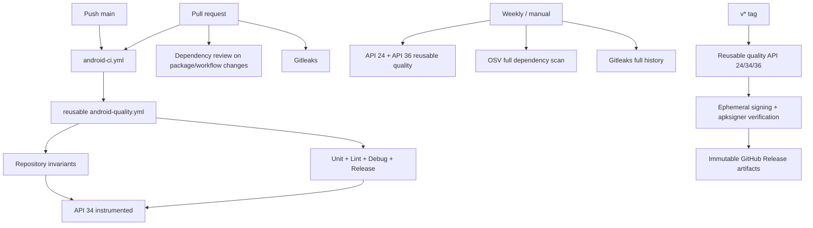

# YANJI-C Automation / CI / Migration Guardrails Report

Date: 2026-09-16  
Branch: `agent/repo-automation`  
Baseline: Agent B design-system branch plus merged Agent A backend/data/security hardening

## Executive Summary

The existing reusable Android quality workflow was extended rather than duplicated. Three low-cost repository invariants now run in an independent `guards` job: runtime fixture detection, README/source fact consistency, and the existing design-token ratchet. `AppInitializerInstrumentedTest` now covers every business table, including the retained QuickStart compatibility tombstone.

Dependency verification is active in strict SHA-256 mode for the resolved build graph (583 components / 972 artifacts, including separately reviewed Windows/Linux AAPT2 binaries and Linux UTP module metadata). PR dependency changes receive a high/critical vulnerability review. Gitleaks runs on PRs and weekly/manual full-history scans with a narrow allowlist mechanism. OSV runs weekly/manual, not on ordinary PRs, so service availability cannot block source-only changes.

Local JVM/lint/debug/release verification passed. Instrumented sources compile. Connected tests were **BLOCKED**, because the only physical device had an active foreground focus session and the available AVD cannot start without a Windows hypervisor driver. The session was not interrupted. OSV itself ran successfully but returned **FAIL** because the current resolved build graph contains known advisories; these findings were not suppressed.

| Area | Current | Proposed / implemented | Benefit | Risk | Priority |
|---|---|---|---|---|---|
| CI structure | Reusable quality workflow already existed | Independent guards + existing build + API 34 instrumented jobs | Visible failures without duplicating workflows | More required checks | P0 |
| Runtime data | Initializer writes only settings | Pattern/initializer guard + all-table regression test | Prevents fake data reintroduction | Allowlist requires review discipline | P0 |
| Documentation facts | README had a remaining Room v11 claim | Source-derived facts marker and mismatch scan | Stops SDK/version/schema drift | Simple parser depends on current Gradle style | P1 |
| Dependencies | Dependabot only | SHA-256 verification + PR dependency review + scheduled OSV | Detects tampering and new severe vulnerabilities | Existing OSV findings require triage | P1 |
| Secrets | Ignore rules only | Gitleaks default/custom rules, full history, reviewed allowlist | Detects leaked keys/passwords/private keys | Organization forks need a Gitleaks license | P1 |
| Scripts | ADB scripts contained owner paths | Repo-root/env/PATH discovery | Portable local and CI execution | Bash remains required | P1 |
| QuickStartPreset | Dead runtime feature; backup-compatible table remains | ADR-backed compatibility tombstone and staged exit | Avoids unsafe v13/backup rewrite | Dead schema surface remains | P2 |
| Navigation3 | Partial, unused dependency | Agent A removal retained; dependency report confirms no source consumer | Smaller dependency surface | Full future migration needs a new decision | P2 |
| Static analysis | Android Lint + token guard | Keep those; do not add Detekt without finding-based evaluation | High signal, low maintenance | Complexity rules remain manual | P3 |

## CI workflow

## Migration flow

No `fallbackToDestructiveMigration()` exists or was added. The full decision is in `docs/adr/0001-retain-quick-start-compatibility-tombstone.md`.

## Added checks

- `scripts/check-runtime-fixtures.sh`
  - Scans `app/src/main` for the named high-risk seed/fake/sample patterns.
  - Detects fixture-shaped collection declarations, hard-coded bulk inserts, and business entities constructed by initializers/applications.
  - Uses exact `path|rule|normalized-line` allowlist signatures; “Mock Exam / 模拟考试” is not a trigger.
- `scripts/check-project-facts.sh`
  - Extracts compile/min/target SDK, version code/name, Room schema, and Room library version.
  - Compares them with a single README facts marker and rejects any stale `Room vN` prose claim.
- Existing `scripts/check-design-tokens.sh`
  - Retained as the single design guard.
  - Raw color/static-light-token ceilings remain zero; the raw radius ratchet was lowered from 74 to the observed Agent B baseline of 64.
- `AppInitializerInstrumentedTest`
  - Fresh install: one settings row, zero business rows.
  - Clear + reinitialize: focus, exam, journal, chat session/message, check-in, achievement, and QuickStart all remain zero.

## Removed duplication

- No second Android build/test workflow was created.
- Repository invariants were moved into an independent job inside the reusable quality workflow.
- Dependency review and security scanning are purpose-specific workflows, not alternate build pipelines.
- No second design-token checker or Detekt/ktlint/Semgrep stack was added.

## Security gates

| Gate | Trigger | Policy | Local result |
|---|---|---|---|
| Gradle dependency verification | Every Gradle resolution | SHA-256 for 583 components / 972 artifacts | PASS locally in strict mode; Linux-only artifacts added from reviewed Google Maven/Maven Central sources |
| Dependency review v5.0.0 | PR package/workflow changes | Fail new runtime high/critical advisories; explicit availability preflight | BLOCKED: repository Dependency graph is disabled; review step skips with a notice |
| Gitleaks action v3.0.0 / CLI 8.30.1 | Every PR; weekly/manual full history | Default rules + Yanji signing/password rules; redact output | PASS: 50 commits, ~2.60 MB, no leaks |
| OSV Scanner 2.6.0 | Weekly/manual | Full recursive scan; scheduled failure alerts maintainers | FAIL: 90 advisory/package tuples, 49 unique advisories across 22 package versions |
| Ignore policy | Local and CI | Ignore keystores, private-key containers, local props, DBs, device/user backups | PASS: no prohibited tracked file found |

The OSV result is a finding result, not a scanner outage. Most hits are transitive build/test tooling visible through Gradle verification metadata (for example Netty, Kotlin Gradle plugin, Bouncy Castle); reachability and runtime scope have not been triaged, so this report does not claim that the shipped APK is affected or unaffected.

## Test matrix

| Layer | Coverage | Status | Evidence |
|---|---|---|---|
| Unit | Timer state machine, AI protocol/client, backup codec, statistics, achievements, stores, check-in, secret store | PASS | `:app:testDebugUnitTest` in strict full build |
| Room | Historical 1→12 chain, explicit 11→12 coverage, schema files, backup codec | PASS | JVM unit suite |
| Android Lint | App + dependencies, errors abort build | PASS | 0 errors, 9 warnings |
| Build | Debug APK and unsigned R8/resource-shrunk release APK | PASS | `assembleDebug` and `assembleRelease` |
| Instrumented source | All androidTest Kotlin, including strengthened initializer test | PASS | `:app:compileDebugAndroidTestKotlin` |
| Connected instrumented | Full device suite | BLOCKED | Physical device had active foreground `FocusTimerService`; AVD failed because hypervisor driver is absent |
| API 24 / 34 / 36 CI | Reusable scheduled/release matrix | NOT RUN | Requires pushed GitHub Actions runs |
| Visual/accessibility | 360×800, 390×844, 412×915, 1.3x font, light/dark semantics/bounds tests exist | NOT RUN | Connected test execution blocked |
| Process restoration / critical navigation | Existing unit/instrumented tests | PARTIAL | JVM navigation recreation passed; device execution blocked |

## Build results and timing

| Measurement | Result | Time / notes |
|---|---|---|
| Dependency report | PASS | 4.5 s; `build/dependencies.txt` generated and ignored |
| Verification-metadata bootstrap | Expected initial FAIL | `help` graph omitted AAPT2 detached configuration; strict build rejected it |
| Reviewed metadata completion + combined validation | PASS | 3 min 56 s; 62 tasks executed, 16 from cache, 27 up-to-date |
| Strict verification warm combined validation | PASS | 3 s; 101 tasks up-to-date, 1 from cache, 3 executed |
| AndroidTest Kotlin compile | PASS | 4 s build time |
| Cold CI | NOT RUN | Local run was mixed-cache, not a clean hosted runner |
| Individual unit/lint/assemble timing | NOT RUN | Only combined timings were collected; no unsupported speedup claim is made |
| Instrumented timing | BLOCKED | See device/hypervisor limitation above |

No cache setting was changed. Existing Gradle build and configuration cache settings were retained because this task did not establish hosted-runner cold/warm evidence.

## Known limitations

1. OSV currently fails on existing advisories. Remediation needs scope/reachability analysis and controlled Gradle/Kotlin/AGP upgrades; no broad upgrade was hidden in this guardrail PR.
2. Dependency verification uses SHA-256, not PGP. The generated candidate was checked for expected coordinates/checksum structure and then proven by a strict full build, but future metadata diffs still require human review.
3. GitHub Dependency Review reported that Dependency graph is disabled. The workflow now detects that state and skips with an explicit notice; enable Dependency graph in repository security settings to activate the high/critical PR gate. Scheduled OSV and remote API emulator results remain separate GitHub evidence.
4. The complete connected suite is BLOCKED locally. The user’s physical focus session was deliberately preserved; the API 35 AVD reported “Android Emulator hypervisor driver is not installed.”
5. QuickStartPreset remains as a documented compatibility tombstone. Removing it requires a separately approved v13 migration and backup-major-version policy.
6. The project-facts guard is intentionally small and tied to the current Kotlin DSL formatting. If build declarations move into convention plugins, update the extractor and its README marker together.

## Rollback plan

- Guards: revert the relevant guard commit; do not loosen an allowlist or ratchet silently.
- Dependency verification: revert `build: enable dependency verification` as a standalone commit if repository resolution is blocked; preserve the metadata diff for investigation.
- Security workflows: disable the affected purpose-specific workflow while retaining local reports; never turn a vulnerability result into success with `continue-on-error`.
- Portable scripts: revert only the script portability commit; device backups remain under ignored `build/device-backup`.
- QuickStart compatibility: keep Room v12/table/backup field. No database rollback is needed because this branch performs no schema change.
- Release: do not create a tag while required remote gates are red or unverified.

## Estimated remaining effort

| Work | Estimate |
|---|---|
| OSV scope/reachability triage and safe dependency upgrades | 1–3 engineer-days |
| Restore Windows emulator acceleration or run API 34 on CI and fix failures | 0.5–2 engineer-days |
| Optional QuickStart Room v13 + backup compatibility work | 1–3 engineer-days |
| Hosted CI cold/warm measurement and cache tuning decision | 0.5–1 engineer-day |
| GitHub branch-protection/environment configuration and release dry run | 0.5–1 engineer-day |
