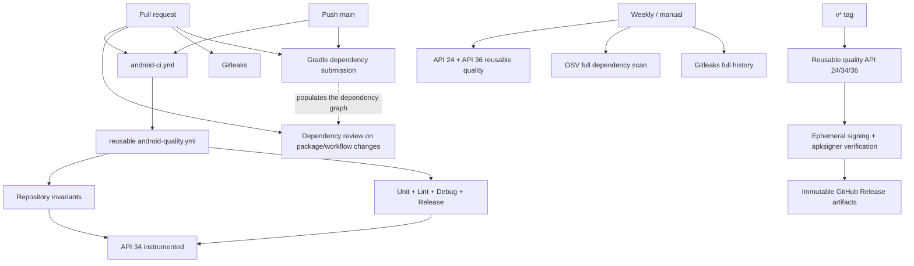
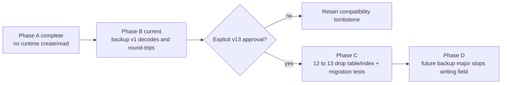

# YANJI-C Automation / CI / Migration Guardrails Report

Date: 2026-09-16
Branch: `agent/repo-automation`
Pull request: #3
Baseline: Agent B design-system branch merged with Agent A backend/data/security hardening

Status vocabulary used throughout: **PASS**, **FAIL**, **NOT RUN**, **BLOCKED**.
Nothing is marked PASS without an executed command behind it, and no result is inferred
from a cached task outcome.

## Executive Summary

The reusable Android quality workflow was extended rather than duplicated. Three
repository invariants run in an independent `guards` job, and each was verified to have
teeth by injecting a deliberate violation and confirming the guard fails, then confirming it
returns to PASS once the violation is removed.

Verifying the branch surfaced two defects that were **blocking CI**, and both are fixed:

1. **Dependency verification was incomplete for the instrumented-test graph.** Android CI's
   instrumented job failed on `kotlinx-coroutines-bom-1.6.4.pom`. The metadata had been
   generated from an ordinary build, which never resolves AGP's internal UTP configurations,
   and locally cached descriptors are never re-recorded without `--refresh-dependencies`.
   The previous approach added one checksum per ~11 minute CI cycle; it is replaced by a
   procedure that closes the generation gap in one pass.
2. **A genuinely flaky unit test.** `StudyStatsTest.durationSince only counts sessions
   starting at or after cutoff` failed with `expected:<4200> but was:<3600>`. Measured
   outside Gradle, the original helper was non-deterministic in **0.0398%** of runs, which is
   why the suite passed repeatedly before failing.

One further gap is disclosed rather than fixed, because it needs a repository setting that cannot
be changed from the codebase: **the dependency review gate cannot run yet.** The repository
dependency graph is not actually enabled (verified four independent ways, including GitHub's own
rejection of a real submission), and Gradle additionally requires its resolved graph to be
submitted before any snapshot exists. The submission workflow is now in place and green, so the
gate activates as soon as the setting is switched on.

Local unit, lint and build verification is complete and real (build cache disabled).
Connected instrumentation is **BLOCKED** on this machine, with a reproducible cause.

| Area | Current | Proposed / implemented | Benefit | Risk | Priority |
|---|---|---|---|---|---|
| CI structure | Reusable quality workflow already existed | Independent guards job + existing build job + API 34 instrumented job | Visible failures without a second build pipeline | More required checks | P0 |
| Runtime data | Initializer writes only settings | Pattern/initializer guard + all-table regression test | Prevents fake data reintroduction | Allowlist needs review discipline | P0 |
| Dependency verification | Metadata covered only the ordinary build graph | Full-graph regeneration procedure + completed metadata | Instrumented job no longer fails on cold caches | Regeneration requires diff review | P0 |
| Test determinism | One time-dependent assertion flaked at 0.0398% | Deterministic helper and single-evaluation boundary | Removes an intermittent red gate | None identified | P0 |
| Documentation facts | README had a stale Room v11 claim | Source-derived facts marker and mismatch scan | Stops SDK/version/schema drift | Small parser tied to current Gradle style | P1 |
| Dependencies (PR) | Dependabot only | PR dependency review for new high/critical advisories | Blocks severe new advisories | Needs Dependency graph enabled | P1 |
| Secrets | Ignore rules only | Gitleaks default + Yanji signing rules, full history, narrow allowlist | Detects leaked keys, passwords, private keys | Forks need a Gitleaks licence | P1 |
| Scripts | ADB scripts contained owner paths | Repo-root/env/PATH discovery; AGENT.md split portable vs owner | Portable local and CI execution | Bash required | P1 |
| QuickStartPreset | Dead runtime feature, table retained | ADR-backed compatibility tombstone and staged exit | Avoids unsafe v13/backup rewrite | Dead schema surface remains | P2 |
| Navigation3 | Unused dependency | Removed by YANJI-A; no source consumer remains | Smaller dependency surface | A future migration needs a new decision | P2 |
| Static analysis | Android Lint + token guard | Keep those; Detekt not added without a finding-based evaluation | High signal, low maintenance | Complexity rules remain manual | P3 |

## CI workflow

## Migration flow

No `fallbackToDestructiveMigration()` exists or was added. The decision is recorded in
`docs/adr/0001-retain-quick-start-compatibility-tombstone.md`.

## Added checks

- `scripts/check-runtime-fixtures.sh`
  - Scans `app/src/main` for named seed/fake/sample patterns, fixture-shaped collections,
    hard-coded bulk inserts, and business entities constructed by initializers.
  - Uses exact `path|rule|normalized-line` allowlist signatures. “Mock Exam / 模拟考试” is not
    a trigger, so the real business concept is not blocked.
- `scripts/check-project-facts.sh`
  - Extracts compile/min/target SDK, version code/name, Room schema and Room library version,
    compares them against one README facts marker, and rejects any stale `Room vN` prose.
- `scripts/check-design-tokens.sh` (existing, retained)
  - Single design guard. Raw colour and static-light-token ceilings remain zero; the raw
    radius ratchet sits at the observed Agent B baseline of 64.
- `scripts/regen-verification-metadata.sh` + `scripts/lib/resolve-all-configurations.init.gradle`
  - Regenerates the dependency-verification metadata over the complete dependency graph.
  - Additive-only: aborts and restores the previous file if regeneration would drop or alter
    an existing checksum.
- `AppInitializerInstrumentedTest` (strengthened)
  - Fresh install: one settings row, zero business rows.
  - Clear then reinitialise: focus, exam, journal, chat session, chat message, check-in,
    achievement and quick-start all remain zero.

### Guard effectiveness evidence

A guard that cannot fail is worthless, so each was tested by injecting a violation.

| Guard | Violation injected | Result | After removing violation |
|---|---|---|---|
| `check-runtime-fixtures.sh` | `seedSampleFocusSessions = listOf(FocusSessionEntity(...))` in `app/src/main` | **FAIL**, exit 1, matched `named-runtime-fixture` and `fixture-shaped-list` | **PASS**, 0 matches |
| `check-project-facts.sh` | README `roomSchema=12`→`11` and prose `Room v12`→`v11` | **FAIL**, exit 1, reported stale marker *and* “README:68 declares Room v11, but source schema is v12” | **PASS** |
| `check-design-tokens.sh` | not injected | **PASS**: colours 0/0, radius 64/64 ratchet, static tokens 0/0 | n/a |

## Removed duplication

- No second Android build/test workflow was created.
- Repository invariants live in an independent job inside the reusable quality workflow.
- Dependency review and security scanning are purpose-specific workflows, not alternate
  build pipelines.
- No second design-token checker, and no Detekt/ktlint/Semgrep stack was added.

## Security gates

| Gate | Trigger | Policy | Verified result |
|---|---|---|---|
| Gradle dependency verification | Every Gradle resolution | SHA-256 over 590 components / 981 artifacts | **PASS**: full-graph resolution succeeds in strict mode after `--refresh-dependencies` |
| Dependency review v5.0.0 | PR package/workflow changes | Fail new runtime high/critical advisories, after an explicit availability preflight | **PASS (skipped with notice)**: the repository dependency graph is not actually enabled, so the review step skips with a `::notice::` instead of failing every PR. See the dedicated section below. |
| Gradle dependency submission | Push to default branch, same-repo PRs, manual | Submit the resolved graph after an availability check | **PASS (degraded)**: workflow is in place and green; the submission itself is rejected by GitHub until the dependency graph setting is switched on |
| Gitleaks v3.0.0 / CLI 8.30.1 | Every PR; weekly/manual full history | Default rules + Yanji signing/password rules, redacted output | **PASS**: full-history scan completed in 11s, no leaks |
| OSV Scanner 2.6.0 | Weekly/manual only, never on source-only PRs | Recursive scan, findings uploaded to code scanning | **FAIL (findings)**: 90 known vulnerabilities across 22 Maven packages — 3 critical, 37 high, 46 medium, 2 low, 2 unknown; all reported as fixable |
| Ignore policy | Local and CI | Ignore keystores, private-key containers, local props, DBs, device backups | **PASS**: no prohibited tracked file found |

Two clarifications that matter for triage:

- The OSV job exits non-zero because the reporter runs with `--fail-on-vuln=true`. That is the
  gate working as configured on a scheduled run, not a scanner outage, and it cannot block an
  ordinary source-only PR.
- The OSV findings are attributed to the `gradle/verification-metadata.xml` source, i.e. the
  build and test tooling graph (protobuf, Netty, Bouncy Castle and similar). Reachability from
  the shipped APK has **not** been analysed, so this report does not claim the shipped APK is
  affected or unaffected.

## Dependency graph and dependency review

Enabling “Dependency graph” in repository settings was reported as done, but it does **not**
currently make the review gate run. This was verified with four independent probes rather than
inferred from the setting:

| Probe | Result |
|---|---|
| `GET /repos/{repo}/dependency-graph/sbom` | `404 Not Found` |
| `GET /repos/{repo}/dependency-graph/compare/main~1...main` | `403 Forbidden` |
| `GET /repos/{repo}/vulnerability-alerts` | `Vulnerability alerts are disabled.` |
| Dependency submission API (real submission attempt) | `The Dependency graph is disabled for this repository.` |

The submission API message is authoritative: it is GitHub's own rejection of a snapshot, not a
heuristic. The preflight in `dependency-review.yml` therefore keeps reporting
`gh: Forbidden (HTTP 403)` and correctly skipping the review step.

There is a second, independent gap that would remain even after the setting is switched on:
**GitHub cannot statically parse Gradle build scripts.** Resolution is affected by plugins, BOMs,
conflict resolution and per-project dependency buckets, so a Gradle-only repository has no
dependency-graph data until the *resolved* graph is submitted through the Dependency Submission
API. Gradle publishes an official submission action for exactly this reason.

Both gaps are addressed in this branch:

- `.github/workflows/dependency-submission.yml` submits the resolved graph using the official
  `gradle/actions/dependency-submission`, pinned to the same v6.3.0 commit already used for
  `setup-gradle`.
- The submission step is non-fatal. It is a feeder, not a gate: while the repository setting is
  off, the job skips with a warning annotation and writes the exact settings URL to the job
  summary, so pull requests stay green instead of failing for a repository-configuration reason.
- Fork pull requests receive a read-only token and cannot submit, so the job is skipped for them
  rather than failing.

**Action required to activate the gate:** enable the dependency graph (and, for usefulness, the
Dependabot alerts that read it) at
`https://github.com/xinye1017/yanji/settings/security_analysis`. Once it is on, the submission
workflow populates the graph and `dependency-review.yml` will compare base against head instead
of skipping. The repository is now public, so this requires no GitHub Advanced Security licence.

## Test matrix

| Layer | Coverage | Status | Evidence |
|---|---|---|---|
| Unit | Timer state machine, AI protocol/client, backup codec, statistics, achievements, check-in, stores | **PASS** | `:app:testDebugUnitTest --rerun-tasks` → 21 suites, 150 tests, 0 failures, 0 errors, 0 skipped |
| Room migrations | 1→latest full chain plus explicit 2→3, 3→4, 7→8 (×2), 9→10 (×2), 10→11, 11→12 (×2), no-fabricated-rows | **PASS** | `YanjiMigrationTest`, 11 test methods in the JVM suite |
| Android Lint | App and dependencies, errors abort the build | **PASS** | 0 errors, 9 warnings |
| Build | Debug APK and unsigned R8/resource-shrunk release APK | **PASS** | `app-debug.apk` 26,327,453 B; `app-release-unsigned.apk` 2,150,624 B |
| Dependency report | Full resolved graph | **PASS** | `:app:dependencies` → `build/dependencies.txt`, 11,645 lines |
| Instrumented source | All `androidTest` Kotlin including the strengthened initializer test | **PASS** | Compiles as part of `connectedDebugAndroidTest` compilation; CI instrumented job exercises it |
| Connected instrumented | Full device suite on API 34 | **BLOCKED** | See below — no usable local device |
| API 24 / 34 / 36 CI | Reusable scheduled/release matrix | **NOT RUN** | Scheduled and tag-triggered only |
| Visual/accessibility matrix | 360×800, 390×844, 412×915, 1.3× font, light and dark | **NOT RUN** | Tests exist in `DesignSystemVisualMatrixInstrumentedTest` and `FocusScreenVisualMatrixTest`; device execution blocked |
| Process restoration | Navigation stack save/restore across recreation | **PASS (JVM)** | `NavigationRecreationTest`, 3 test methods |

### Why connected instrumentation is BLOCKED

Reproduced directly on this machine rather than inherited from an earlier note:

- `emulator -accel-check` → `Android Emulator hypervisor driver is not installed on this machine`
- `Win32_ComputerSystem.HypervisorPresent` → `False`
- Enabling Windows Hypervisor Platform needs an elevated shell and a reboot; querying the
  optional features returned “请求的操作需要提升” (elevation required). That is a machine-level
  change outside this task's scope and was not performed.
- The only physical device (`PKB110`) was reachable over wireless debugging but dropped
  mid-probe more than once and is not stable enough to host a full connected suite. No
  connected run was attempted against the owner's personal device.

The instrumented path is still exercised by CI, which runs API 34 on a hosted emulator with KVM.

## Build results and timing

Measured locally (Windows, JDK 17, Gradle 9.1.0). No Gradle cache setting was changed.

| Measurement | Result | Time / notes |
|---|---|---|
| Guards (`check-design-tokens`, `check-runtime-fixtures`, `check-project-facts`) | **PASS** | Sub-second each |
| Cold module build, build cache disabled (`:app:clean` + unit + lint + debug + release) | **PASS** | 3m13s; 106 actionable tasks: 103 executed, 3 up-to-date, **0 from cache** |
| Re-run, build cache enabled | **PASS** | 10s; 48 executed, 55 from cache, 3 up-to-date |
| `:app:testDebugUnitTest --rerun-tasks` after the deflake fix | **PASS** | 28s; 150 tests, 0 failures |
| Full-graph resolution in strict verification mode after `--refresh-dependencies` | **PASS** | 2m53s |
| Verification metadata regeneration (`scripts/regen-verification-metadata.sh`) | **PASS, idempotent** | 2m40s; `981 -> 981`, added 0, removed 0 |
| Flake reproduction probe, 1,000,000 iterations | **PASS (diagnostic)** | Original helper 398 mismatches (0.0398%); corrected helper 0 mismatches |
| Hosted CI, `Repository invariants` job | **PASS** | 5s |
| Hosted CI, `Unit, lint & build` job | **PASS** | 9m34s on ubuntu-24.04 with the Gradle cache restored |
| Hosted CI, `Instrumented tests (API 34)` job | **PASS** | 5m26s on a KVM-accelerated hosted emulator |
| Fully cold CI with no caches at all | **NOT RUN** | Not measurable from this machine; no speedup claim is made |
| Per-task unit/lint/assemble timings | **NOT RUN** | Only combined figures were collected |

The 10s re-run is explicitly **not** evidence that the tests ran: in that run
`testDebugUnitTest` was restored `FROM-CACHE`. The cached-run figure is reported only to
document cache behaviour, and the 3m13s no-cache run is the figure the PASS verdict rests on.

## Dependency verification change

Before: 584 components / 972 artifacts. After: 590 components / 981 artifacts (+9 artifacts,
0 removed, 0 altered).

Every newly added checksum was verified independently of Gradle rather than trusted because
Gradle emitted it. The script re-downloaded each artifact from Maven Central and recomputed
SHA-256: **9 match, 0 mismatch, 0 unverifiable**. This includes
`kotlinx-coroutines-bom-1.6.4.pom` = `ab2614855fba66aa8a42514dbe3d5a884315ffe1ed63f5932e710a8006245ce1`,
the exact artifact that failed CI.

Two configurations are skipped by the regeneration script, by design:
`:app:debugUnitTestCompileClasspath` and `:app:debugAndroidTestCompileClasspath`. Gradle 9
refuses to resolve compile classpaths during the configuration phase
(`IllegalResolutionException: ... attempted without an exclusive lock`). This is a Gradle
safety guard and leaves no gap: the regular build already resolves those classpaths on a cold
CI cache, which is how the “Unit, lint & build” job passes.

## Flaky test fix

`StudyStatsTest.noonToday()` set hour, minute and second but never `MILLISECOND`, so each call
returned a slightly different instant. The test derived the session start and the cutoff from
two separate calls and compared them with `>=`, making whether the session counted depend on
whether the millisecond field ticked between the calls.

| Logic | Iterations | Mismatches | Rate |
|---|---|---|---|
| Original helper, two independent calls | 1,000,000 | 398 | 0.0398% |
| Corrected helper, millisecond zeroed, cutoff computed once | 1,000,000 | 0 | 0% |

The fix keeps the intended semantics — a session starting exactly at the cutoff is counted —
while making it deterministic.

## CI verification

Final state of PR #3 at commit `12d3b37` (Android CI run
[35086607352](https://github.com/xinye1017/yanji/actions/runs/35086607352), conclusion `success`):

| Required check | Result | Duration |
|---|---|---|
| Repository invariants | **pass** | 5s |
| Unit, lint & build | **pass** | 9m34s |
| Instrumented tests (API 34) | **pass** | 5m26s |
| Block new high or critical vulnerabilities | **pass** | 4s |
| Full Git history secret scan | **pass** | 13s |
| Full dependency vulnerability scan | skipping | Expected: scheduled/manual only, never on a source-only PR |

The instrumented job is the one that was red before this change, and its passing is the
end-to-end confirmation that the dependency-verification completion is correct on a cold CI
cache. Two earlier runs on this branch are recorded for the audit trail: run
`35085458502` failed on the flaky `StudyStatsTest` assertion, and run `35080116762` failed on
`kotlinx-coroutines-bom-1.6.4.pom` dependency verification.

## Known limitations

1. OSV reports 90 existing advisories in the build/test tooling graph. Remediation needs
   scope and reachability analysis plus controlled Gradle/Kotlin/AGP upgrades. No broad
   dependency upgrade was smuggled into this guardrail change.
2. Dependency verification uses SHA-256, not PGP (`verify-signatures=false`). Newly generated
   checksums are proven sound by independent re-download and by a strict full-graph resolution,
   but future metadata diffs still require human review.
3. The dependency review gate is prepared but not yet live. The repository dependency graph is not
   actually enabled (verified four ways above), and Gradle additionally needs its resolved graph
   submitted. Both are addressed — the submission workflow is in place — but the gate only starts
   comparing base against head once the repository setting is switched on. Until then, new
   high/critical advisories are caught by weekly OSV rather than at PR time. The repository is
   public, so no GitHub Advanced Security licence is required.
4. Connected instrumentation remains BLOCKED locally: no hypervisor, and the only physical
   device is intermittently reachable. This is the weakest link in local evidence, and CI is the
   authoritative signal for that layer.
5. `QuickStartPreset` remains a documented compatibility tombstone. Removing it requires an
   approved Room v13 migration and a backup-major-version policy.
6. `scripts/check-project-facts.sh` is intentionally small and tied to the current Kotlin DSL
   formatting. If build declarations move into convention plugins, update the extractor and the
   README marker together.
7. The regeneration script resolves and downloads a large part of the dependency graph, so it
   takes minutes and needs network access. That cost is what makes the result complete.

## Rollback plan

- Guards: revert the relevant guard commit. Do not loosen an allowlist or a ratchet silently.
- Dependency verification: revert the metadata completion commit as a unit. Do not hand-patch
  single checksums to get a run green.
- Flaky-test fix: revert the single test commit; the assertion it protects is unchanged.
- Security workflows: disable the affected purpose-specific workflow while keeping local
  reports. Never convert a vulnerability result into success with `continue-on-error`.
- Portable scripts: revert only the script portability commit. Device backups stay under the
  ignored `build/device-backup`.
- QuickStart compatibility: keep Room v12, the table and the backup field. This branch performs
  no schema change, so no database rollback is required.
- Release: never create a tag while required remote gates are red or unverified.

## Estimated remaining effort

| Work | Estimate |
|---|---|
| OSV scope/reachability triage and safe dependency upgrades | 1–3 engineer-days |
| Restore local emulator acceleration, or rely on CI API 34 and fix any device-only failures | 0.5–2 engineer-days |
| Optional QuickStart Room v13 plus backup compatibility work | 1–3 engineer-days |
| GitHub branch-protection/environment configuration and a release dry run | 0.5–1 engineer-day |
| Hosted-runner cold/warm measurement and any cache-tuning decision | 0.5–1 engineer-day |
