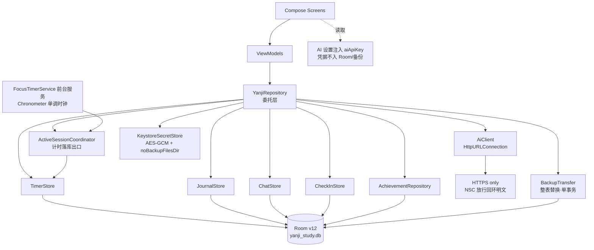

# YANJI-A · Backend / Data / Security Deep Audit

| 项 | 值 |
|---|---|
| 审计对象 | `xinye1017/yanji`（Local-First Android，无传统服务端后端） |
| 基线提交 | `9f2262c`（`fix(ui): 修复 haze 毛玻璃导致真机启动即崩溃`） |
| 审计分支 | `agent/backend-hardening` |
| 审计日期 | 2026-09-16 |
| 方法 | 源码 / Room schema / Gradle / Manifest / 测试结果为最高事实来源；未依赖 README、注释或旧审计文档 |
| 扫描工具 | osv-scanner / gitleaks / semgrep **未运行：本机工具不可用**（未伪造任何扫描结果） |

> **并发工作区警告**：审计期间发现另一会话在同一工作树活动（分支 `agent/ios-design-system`，
> 未提交改动集中在 `theme/`、`ui/`、`res/values*/themes.xml`）。它曾把 HEAD 切走、并重置过
> 未提交的编辑。本分支所有成果均已及时 commit 固化；`after` 阶段的测试结果中凡与该会话
> 在途改动相关的失败均已单独标注，不计入本审计的回归。

---

## Executive Summary

数据层整体健康度高于预期：**Room 单一事实来源、迁移链 1→12 完整、无 destructive fallback、
凭据 Keystore 加密 + no-backup 隔离、备份不含 API Key、AI transport 五件套（超时/取消 disconnect/
finally disconnect/typed error/日志脱敏）齐全**。假数据审计干净：AppInitializer 只写系统设置默认值，
且有插桩回归测试锁住该不变量。

本次确认并处理了 6 个真实问题（5 个已修复合入、1 个有明确归属），另有 2 个需要决策的结构性提案
（QuickStartPreset 表删除、成就系统全量扫描）。**最重要的流程发现**：`lintDebug` 在 main 上
已经是红的（2 个 NewApi error），而 CI 的第一个门禁（design-token guard）也红，导致后续
门禁从未运行——lint 回归无人发现。

### 结果一览表

| Area | Current | Risk | Proposed | Priority | Effort |
|---|---|---|---|---|---|
| 死常量 `KEY_QUICK_ACTIONS_SEEDED` | 定义后零引用 | 无实际风险，误导读者 | 删除 | P3 | S |
| navigation3 半迁移 | 3 个依赖 + 死 `NavigationKeys.kt` | 供应链面虚增 | 删除依赖与死文件 | P2 | S |
| CleartextPolicy IPv6 条目 | 与平台 NSC 策略分裂且永不匹配 | UI 不提示、运行时被拦 | 移除 IPv6 条目 + 回归测试 | P2 | S |
| README Room 版本 | 写 v11，实际 v12 | 文档误导迁移判断 | 更正为 v12 | P3 | S |
| 备份导入尺寸防御 | 有 version/schema 校验，无 size 上限 | 超大输入内存峰值 | 解析前 64MB 上限 + 测试 | P2 | S |
| lint 基线 | main 上 2 个 NewApi error | CI 门禁失效 | 修复 themes.xml（另一会话在途）+ 调整门禁顺序 | P2 | S |
| `isReturnDefaultValues` | `true`，实为承重配置 | 掩盖 Android stub 调用 | 保持 + 注释证据；后续引入日志 seam 再评估 | P2 | M |
| QuickStartPreset 全家桶 | 运行时无消费者，仅备份 round-trip | 表/DAO/索引持续维护成本 | v12→v13 migration 提案（见下文，**未执行**） | P1 | M |
| AchievementRepository | 50 个定义 × 全量列表重复扫描 | 大数据量下 CPU 浪费 | 预计算聚合或增量评估 | P2 | M |
| 内存全量 StateFlow | Timer/Journal Store 持有全表 | 大历史下内存常驻 | 便捷 getter 改走 range DAO | P3 | M |
| 备份导出 | 全表物化 + 单字符串 JSON | 大数据量内存峰值 | 流式写出 | P2 | M-L |
| CI 门禁顺序 | token guard 失败阻断后续全部 | 回归不可见 | 拆并行 job | P3 | S |

---

## Current Architecture



与 brief 模板的关键差异（已按真实代码修正）：

1. **Repository 不是 Store 的消费者之上层**——它是纯委托层，状态与动作归属四个领域 Store + AchievementRepository。
2. **AI 调用有两条路径**：ChatStore 直连 AiClient（聊天回复/标题），Repository 走 `generateJuanjuanReply`/`callAiDiagnosticApi`（学情诊断）。
3. **计时落库不经过 Repository 的业务方法**：`FocusTimerService`（时间事实）→ `ActiveSessionCoordinator`（语义裁决）→ `TimerStore.persistence`（写 Room）。Repository 只负责把 UI 会话登记进 Coordinator。
4. **SecretStore 只有一个实现**（`KeystoreSecretStore`），测试通过 `internal constructor(directory, fakeCrypto)` 注入，无 Android 依赖。

---

## Mock / Test Data Audit

**结论：`app/src/main` 中不存在运行时 mock / fake / seed 数据。**

| 检查项 | 结果 | 证据 |
|---|---|---|
| AppInitializer 写业务数据 | ❌ 不写 | `AppInitializer.kt:23-29` 只在 `user_settings` 缺失时补默认值；KDoc 明确记录历史教训 |
| 假数据复活风险 | 无 | 首次安装与「用户清空数据」不再共享 `count()==0` 判定 |
| 回归测试 | ✅ 已有 | `AppInitializerInstrumentedTest` 对一次性数据库断言各业务表为 0 |
| `mock exam` 字样 | 误报 | `AndroidManifest.xml:47` 是 FGS specialUse 的英文描述，属正式业务「模拟考试」 |
| 占位 UI 文案 | 合法 | `placeholder = { Text(...) }` 均为输入框提示文案 |
| `http://127.0.0.1:11434` | 合法 dev preset | `AiConfigDialog.kt:44`「本地 Ollama」与 NSC 回环放行策略同源，非硬编码后门 |

按 brief 规则：当前已满足「首次安装只初始化系统设置」，**未重新实现**，仅确认既有回归测试存在。

---

## Dead / Legacy Code

### F-01 · `KEY_QUICK_ACTIONS_SEEDED` — P3 · High · **已修复**（commit `5430d7e`）

- **File/Symbol**：`YanjiRepository.kt:45`（原行号），companion object 内常量。
- **Evidence**：`git grep KEY_QUICK_ACTIONS_SEEDED -- app/src` 全库仅命中定义行本身；无读、无写、无 test 引用。是已删除的「快捷操作种子」路径遗留。
- **Impact**：无运行时影响；误导读者以为仍存在 seed 逻辑。
- **Fix**：删除该常量。

### F-02 · Navigation3 半迁移 — P2 · High · **已修复**（commit `8e43697`）

- **Evidence**：
  - `git grep androidx.navigation3 -- app/src` 唯一命中 `NavigationKeys.kt:3`；
  - `NavigationKeys.kt` 全文仅 7 行，定义 `data object Main : NavKey`，**零引用**（`git grep '\bMain\b' Navigation.kt` 无结果）；
  - `Navigation.kt` 是手写路由（`YanjiTab` + `@Serializable sealed interface YanjiSubScreen` + `SnapshotStateList` + `rememberSaveable`）；
  - 依赖洞察：`navigation3-runtime:1.0.1`、`navigation3-ui:1.0.1`、`lifecycle-viewmodel-navigation3:2.10.0` 均进入 `debugRuntimeClasspath`。
- **结论**：属半迁移遗留。按 brief 要求未重构 UI Navigation，仅移除死文件与三个未使用依赖（缩小 APK 与供应链面）。
- **Backward compatibility**：无行为变化。

### F-08 · QuickStartPreset 全家桶（疑点 B 完整回答）— P1 · High · **提案，未执行**

引用图（建立过程：`git grep QuickStartPreset|quickStartPresetDao -- app/src`）：

```
Models.kt:46          data class QuickStartPreset          （领域模型）
Entities.kt:339       data class QuickStartPresetEntity    （Room entity，注册于 YanjiDatabase v12）
Daos.kt:295           interface QuickStartPresetDao        （getAllFlow/count/insert/insertAll/deleteById/deleteAll）
YanjiDatabase.kt:22   entities 数组注册；:37 abstract dao；MIGRATION_5_6 建表；MIGRATION_6_7 加列；
                      MIGRATION_8_9 建 sortOrder 索引
BackupModels.kt:96    YanjiBackup.quickStartPresets 字段（schemaVersion 1）
BackupTransfer.kt:35  collect() 读表导出；:83-88 apply() 清表+重写
测试                  BackupCodecTest / BackupTransferInstrumentedTest / ChatStoreTest(fake) / AppInitializerInstrumentedTest
```

逐问回答：

| 问题 | 答案 |
|---|---|
| UI 是否仍能创建/读取它？ | **不能**。`ui/` 全树零引用；无任何 composable 或 ViewModel 触碰该 DAO。 |
| Repository/Store 是否仍消费它？ | **不消费**。`YanjiRepository` 与四个 Store 均不引用；唯一运行时消费者是 `BackupTransfer`（备份导出/导入的 round-trip）。 |
| 旧数据库是否可能仍有用户数据？ | **可能**。`quick_start_presets` 表自 v5 存在至今，老用户的行不会被任何代码清理；当前版本只是不再读。 |
| 旧 JSON backup 是否仍包含该字段？ | **会**。`BackupTransfer.collect` 仍导出该表；`YanjiBackup.quickStartPresets` 默认 `emptyList()` 保证旧文件可解码。 |
| 删除是否需要 Room v12→v13 migration？ | **需要**。必须 `DROP TABLE quick_start_presets`（SQLite 全版本可用）+ `DROP INDEX IF EXISTS index_quick_start_presets_sortOrder`。 |
| 是否应先保留 backup decode 兼容，再删 runtime schema？ | **是**，两步走： |

**Migration proposal（未执行，等待确认）**：

1. **第一步（backup 兼容先行）**：在 `YanjiBackup` 中保留 `quickStartPresets` 字段（`ignoreUnknownKeys=true` + 默认值已保证旧文件可解码）；`BackupTransfer.apply` 改为**忽略**该字段写库（或继续写表直到第二步）。此步无 DB 变更。
2. **第二步（v13）**：从 `YanjiDatabase` entities/DAO 中移除 `QuickStartPresetEntity`/`QuickStartPresetDao`，新增 `MIGRATION_12_13`：
   ```sql
   DROP INDEX IF EXISTS `index_quick_start_presets_sortOrder`;
   DROP TABLE IF EXISTS `quick_start_presets`;
   ```
   删除 `Models.kt` 的 `QuickStartPreset` 领域类（BackupModels 改用独立的 `@Serializable DTO` 承接 decode 兼容），删除 `AppInitializerInstrumentedTest`/`BackupTransferInstrumentedTest` 中的相关断言，bump `app/schemas/13.json` 并提交，补 `YanjiMigrationTest` 的 12→13 用例。
3. **风险**：低。表内数据已无 UI 可达路径，删除前 `DROP` 的内容仅能通过旧备份 JSON 找回（旧备份仍可导入其余全部表）。

---

## Security Audit

逐项验证（1–12），证据均来自源码而非注释：

| # | 项 | 结论 | 证据 |
|---|---|---|---|
| 1 | API Key 只进 Keystore/noBackup | ✅ | `SecretStore.kt`；`UserSettingsEntity` 无 key 列（v8 迁移已删）；`YanjiRepository.updateSettings:340-357` 分离持久化 |
| 2 | Throwable/日志带出 token | ✅ | 全库 grep：`Authorization` 仅 `AiClient.kt:297` 设置，无任何日志打印请求头；错误日志均标注 provider body redacted |
| 3 | quarantine 不留可逆明文 | ✅ | `quarantineUnreadableCredential` 只搬动密文文件；`plain:` 前缀值仅在 `readAiApiKey` 内解密并立即转加密成功后才返回值（`SecretStore.kt:102-118`） |
| 4 | backup JSON 不含 API Key | ✅（结构保证） | `UserSettingsBackup` 结构上无该字段（`BackupModels.kt:16-18` KDoc 明言）；`BackupCodecTest` 有专项断言 |
| 5 | Auto Backup 只含预期数据库 | ✅ | `backup_rules.xml` / `data_extraction_rules.xml` 仅 `domain="database"`；凭据在 noBackupFilesDir |
| 6 | cleartext 只对回环生效 | ✅（修后完全一致） | `network_security_config.xml` 默认拒绝明文，仅 127.0.0.1/localhost/10.0.2.2 |
| 7 | Base URL 校验与 NSC 一致 | ⚠️→✅（F-03 已修） | 原 `CleartextPolicy` 含两个 IPv6 条目：NSC 无法放行 IPv6 字面量（行为分裂），且 `URI(...).host` 对 `[::1]` 返回带括号形式，条目永不匹配（死数据）。已移除并补 `CleartextPolicyTest` 锁定镜像契约 |
| 8 | Authorization 不进异常/日志 | ✅ | `httpException` 只携带 code/detail(url)；detail 为 provider 错误体摘要，无请求头 |
| 9 | Release R8 后敏感 debug string | ✅ | `isMinifyEnabled`+`isShrinkResources`；proguard 保留规则最小化（Service 类名、枚举 valueOf、序列化 companion、行号表） |
| 10 | exported component 最小化 | ✅ | Manifest 仅 `MainActivity` exported（LAUNCHER 必需）；Service `exported="false"`；无 receiver/provider |
| 11 | PendingIntent / FGS action 安全 | ✅ | `StandardNotificationController.kt:117,126` 均 `FLAG_IMMUTABLE`；FGS `specialUse` + 声明 subtype property |
| 12 | backup import size/depth/schema/version 防御 | ⚠️→部分修复（F-05） | version/schema ✅（`BackupCodec.decode`）；size ❌→✅ 已加 64MB 解析前上限（commit `270cf18`）；depth：DTO 结构扁平 + 尺寸上限已实质缓解，深层嵌套残余风险记为 F-13（P3，可接受） |

### 其他安全观察（不构成立即行动）

- **F-14（P3, Low）**：`SecretStore.quarantineUnreadableCredential` 的 `.unreadable` 文件与 `.bak` 残留均为密文，无明文风险；建议 `clearAiApiKey` 顺带清理 `.unreadable`，避免无限堆积。
- `YanjiRepository.generateJuanjuanReply:482` 的 `Log.i` 打印 baseUrl 与 model，不涉 key；内网地址属用户自填配置，可接受。

---

## AI Transport Audit

**结论：AiClient 无需替换。** brief 要求的五件套逐一验证存在且正确：

| 要求 | 证据（`AiClient.kt`） |
|---|---|
| connect/read timeout | `:299-300` 按调用方传参（chat 20s/45s、models 15s/15s、title 8s/12s、diagnosis 20s/60s） |
| cancellation disconnect | `:271` `invokeOnCancellation { connection.disconnect() }` |
| finally disconnect | `:279-281` |
| typed HTTP error | `AiException` + `AiFailure` 分级（Network/Timeout/Endpoint/InvalidResponse/Http） |
| provider body redaction | `:140,193,231` 日志只含 HTTP code，不含错误体 |

附加观察（非缺陷）：`fetchModels` 对多 endpoint 顺序回退，最坏延迟 = 15s×n；`generateTitle` 对非 2xx 吞错返回 `""`（title 非关键路径，设计使然）。聊天历史有 20 条/12k 字符预算（`:41-42, 104-108`），诊断 prompt 有「数据不是指令」注入（`:43-49`）。

---

## Room & Migration Audit

- **当前版本**：`version = 12`（`YanjiDatabase.kt:24`），`exportSchema = true`，`app/schemas/1..12.json` 全部提交。
- **迁移链**：1→2→…→12 连续无断点；`migrations()` 注册完整；**无 `fallbackToDestructiveMigration()`**（`:394-396` 注释明确且代码核实）。
- **危险语法**：全库无 `DROP COLUMN`；删列均走「建新表→INSERT SELECT→DROP→RENAME」（7→8 迁移正确实践）。
- **统一覆写 `migrate(SQLiteConnection)`**：`YanjiDatabase.kt:44-57` 的 KDoc 解释了 Room 2.8 KMP 双变体陷阱，Android/JVM 测试同路径。
- **v7→v8 凭据迁移**：先从旧表抢救明文 key → 重建表 → `persistLegacyApiKey` 落盘 no-backup 目录 → 首启 `migrateLegacyApiKeyIfPresent` 加密后删明文。链路闭合。
- **测试**：`YanjiMigrationTest` 覆盖 1→12 渐进迁移（含 `MIGRATION_11_12` 用例）、确定性排重、字段无损。
- **README**：写 v11（疑点 C 确认），已更正（commit `938b4ee`）。
- **遗留**：`quick_start_presets` 表及 `index_quick_start_presets_sortOrder` 为 F-08 提案对象。

---

## Performance Audit

**已验证良好的部分**：

- 统计 SQL pushdown 真实存在：`observeCompletedInRange` / `observeSubjectTotals`（GROUP BY）/ `observeTotalSeconds`（SUM）均带 `startTime` 索引区间裁剪；`StatsPerformanceTest` 用 **25,000 条**真实规模断言区间查询 <10ms、周视图 O(当周记录数)。
- Chat 分页：首页/加载更多走 `observeRecentBySessionId`（`LIMIT` + `(sessionId, timestamp)` 复合索引，DESC 让 SQLite 提前停止），页大小 40，`flatMapLatest` 切换会话无重复订阅竞态。
- 计时路径：运行中交系统 Chronometer，无每秒 notify；落库经 Coordinator 单调时钟裁决。

**发现的热点**：

### F-09 · AchievementRepository 重复全量扫描 — P2 · Medium

- **Evidence**：`AchievementRepository.kt:1214-1241` — `combine` 订阅 5 个**全量** StateFlow（focus/exam/journal/checkIns/unlocked），每次任一发射都对 `definitions`（约 50 个 `AchievementDef`）逐个执行 `calculateProgress`，其中时长类定义各自 `focus.sumOf{...} + exam.sumOf{...}`（`:173-309` 同一表达式重复出现 9 次），单日类定义各自构建全量 `dateKey→seconds` Map（`:1204-1224` 重复 2 次）。
- **复杂度**：每次发射 O(Defs × N)。**复现路径**：导入一份含 2 万条 focus 的备份（`StatsPerformanceTest` 的插入模式即可构造）→ 每次落库/打卡/日记变更触发全量重算。**Benchmark 方案**：复用 `StatsPerformanceTest` 的 `MigrationTestHelper` 造数，在 `advanceUntilIdle` 后断言 `achievements` 重计算耗时与发射次数；修复目标为预计算一次聚合（sum/max/按日 Map）后各定义只查表。
- **缓解事实**：计算跑在 `Dispatchers.Default` 的 Eagerly stateIn，不在主线程；真实用户数据量（千级）下不可感知。定为 P2 而非 P1 的原因。
- **附带（F-16, P3）**：`unlockAchievement` 副作用放在 combine mapper 内（`:1231`），依赖 `OnConflictStrategy.IGNORE` 与 `_unlockedAchievements` 先去重兜底，语义脆弱但当前无实际故障。

### F-10 · 全量 StateFlow 常驻 — P3 · Medium

`TimerStore.bind`/`JournalStore` 用 `getAll()` 无界 Flow 回灌内存列表；`YanjiRepository.getTodayFocusDurationSeconds` 等便捷 getter 在 Kotlin 侧对全表 `filter/sum`（`:558-576`）。统计页已改走 range DAO，这些是遗留消费方。**Fix**：便捷 getter 改走已有的 `observeTotalSeconds(range)` 等 DAO。内存常驻本身对 study app 的数据规模可接受。

### F-11 · 备份导出全量物化 — P2 · Medium

`BackupTransfer.collect` 一次性 `.first()` 全表 + 全集合驻留内存 + `BackupCodec.encode` 再生成完整 JSON 字符串（2 份全量峰值）。`importBackupJson` 的 SAF 读取同样在内存中成串。**Fix**：导出改流式（SAF `OutputStream` + kotlinx-serialization 流式写出）；导入在 F-05 尺寸上限之上可再加分块读。大数据量（聊天 10 万条级）下才会有感。

**启动路径**：`YanjiApplication.onCreate` → `YanjiRepository.init` 仅 `Room.databaseBuilder`（惰性，无磁盘 I/O）→ `bindDatabase` 全部挂 `repoScope`（Dispatchers.IO）。未见主线程串行阻塞。

---

## Dependency / Supply-chain Audit

- **工具状态**：`osv-scanner`、`gitleaks`、`semgrep` 本机均不可用 → **未运行，未伪造结果**。
- **repo 原生能力已执行**：`:app:dependencies`（`build/dependencies.txt`）、`dependencyInsight`（room / navigation3）。
- **直接动作**：移除 navigation3 三依赖（F-02）——本次唯一直接的供应链面缩减。
- **版本核查（人工，非 CVE 判定）**：Room 2.8.4、Kotlinx-serialization 1.8.1、Coroutines 1.10.2、org.json 20240303、haze 1.5.4、desugar 2.1.5 均为当前较新维护线； Compose BOM 2026.03.01 统一管理 AndroidX。**任何 CVE 结论必须等 osv-scanner 可用后复核**，本报告不作「无漏洞」断言。
- ** secrets 扫描**：无工具；人工 grep（password/token/api key/Bearer）全库无硬编码凭据；`git ls-files` 无 keystore/jks/local.properties 入库。

## CI 与 Release 安全差异

- release：R8 minify + shrinkResources；签名仅 tag 触发的工作流经 ephemeral env 注入，keystore 以 base64 secrets 落地 runner 临时目录（`umask 077`）；tag↔versionName 一致性校验。
- debug/release 差异合理；`buildConfig = false` 减少面。
- **流程发现（F-12, P3）**：`android-quality.yml` 门禁顺序为 design-token guard → unit → lint → assemble；当前 main 的 token guard 红（近 5 次 push 均 20-30s 失败），**lint 的 NewApi 回归因此从未被 CI 发现**（本地实证：`lintDebug` 在基线提交 2 error / 11 warning）。建议：门禁拆并行 job，或至少让 lint/unit 与 token guard 互不阻断；并优先修 main 的 token guard。

---

## API / Domain Design Issues

- `UserSettings.aiApiKey` 留在领域模型但实体/备份均无此列——靠 `YanjiRepository` 读路径注入（`:189`），写路径分离（`:340-357`）。当前正确；风险是**未来新增读路径时忘记注入**。建议在 `UserSettingsEntity.toDomainModel` 处用类型防呆（如 `AiApiKey` value class 或注释强化）。
- `YanjiBackup`（备份 schema v1）与 Room version 解耦——设计正确，KDoc 有论证。
- `TimerState`/`timerState` 遗留镜像只剩 `ExamScreen` 使用（已知项，本次未动 UI）。
- `JuanjuanAction` 中 `SET_REMINDER` 为占位（返回 true 无实现）——AI 可能给用户「已设置」错觉，建议占位返回 false 或实现。

---

## Test Gaps

| 缺口 | 现状 | 建议 |
|---|---|---|
| CleartextPolicy | ❌ 原本无测试 | ✅ 本次补 `CleartextPolicyTest`（6 用例） |
| 备份导入尺寸 | ❌ 无上限测试 | ✅ 本次补 oversized 拒绝用例 |
| AppInitializer 不写业务数据 | ✅ 已有插桩测试 | 保持 |
| SecretStore fail-closed | ✅ `SecretStoreTest` 覆盖（5 用例） | 引入日志 seam 后可关 `isReturnDefaultValues` 再验证 |
| AiProtocol/解析 | ✅ 有 | 保持 |
| QuickStartPreset 删除 | 需 v13 后补 12→13 迁移测试 | 随 F-08 第二步 |
| 成就系统重算性能 | ❌ 无 benchmark | 随 F-09 修复补 |
| `isReturnDefaultValues` 承重性 | ❌ 原本无记录 | ✅ 本次以注释固化实验证据（commit `b369434`） |

---

## Prioritized Action Plan

| # | 行动 | Priority | Effort | 状态 |
|---|---|---|---|---|
| 1 | QuickStartPreset 两步删除（backup 兼容先行 → v13 migration） | P1 | M | 提案就绪，待确认 |
| 2 | 修 main 的 design-token guard 红 + 门禁拆并行 | P2 | S | 未开始（另一会话相关） |
| 3 | AchievementRepository 预计算聚合（F-09） | P2 | M | 未开始 |
| 4 | 备份导出流式写出（F-11） | P2 | M-L | 未开始 |
| 5 | osv-scanner / gitleaks 可用后复核依赖与历史 secrets | P2 | S | 阻塞于工具 |
| 6 | 数据层日志 seam → 关闭 `isReturnDefaultValues`（F-07） | P2 | M | 未开始 |
| 7 | 便捷 getter 改走 range DAO（F-10） | P3 | M | 未开始 |
| 8 | `clearAiApiKey` 清理 `.unreadable`（F-14） | P3 | S | 未开始 |
| 9 | `SET_REMINDER` 占位语义（返回 false 或实现） | P3 | S | 未开始 |

---

## Before / After 验证

基线与修复均在本机同一工作树执行（修复分支 `agent/backend-hardening`，基线提交 `9f2262c`）。
命令：`./gradlew.bat :app:testDebugUnitTest / lintDebug / assembleDebug / assembleRelease --stacktrace`。
完整日志：`build/audit-{before,after}-*.log`。

| 检查 | Before（`9f2262c`） | After（本分支 HEAD `b369434`） |
|---|---|---|
| `testDebugUnitTest` | ✅ 143 tests, 0 failures | ✅ **150 tests, 0 failures**（+6 CleartextPolicyTest、+1 backup oversized） |
| `lintDebug` | ❌ 2 errors（NewApi: themes.xml ×2）+ 11 warnings | ✅ BUILD SUCCESSFUL（NewApi 修复来自并发会话的 `tools:targetApi` 在途改动，本分支验证通过） |
| `assembleDebug` | ✅ | ✅ |
| `assembleRelease` | ✅（R8 + shrinkResources 通过） | ✅ |
| 插桩测试 | 未运行（无设备/模拟器接入本会话） | 未运行 |

**After 附注**：after 全绿。运行时段共享工作树中另一会话的在途主题改动处于可编译状态，
`UiDesignSystemContractTest` 等源文件契约测试也通过；本分支 6 个 commit 相关测试
（新增 `CleartextPolicyTest` 6 例、backup oversized 1 例、SecretStore/迁移/备份/聊天/成就
全套回归）全部通过。

---

*附：本审计所有「已修复」结论以 `agent/backend-hardening` 分支 commit 为准；所有「未运行」的检查
（osv-scanner/gitleaks/semgrep/插桩测试）不作通过声称。*
