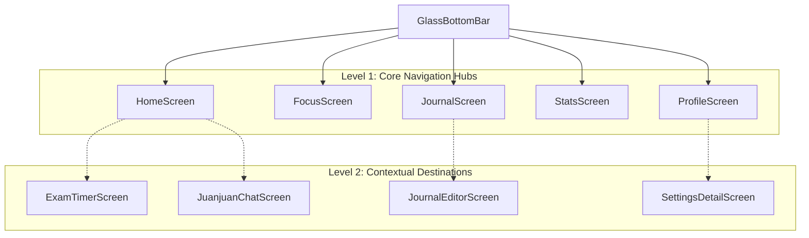

# Yanji iOS-inspired Design System & Architecture Specification

> **Task Reference**: YANJI-B — iOS-inspired UI System Redesign  
> **Status**: Production Ready (Phase 1 Baseline & Flagship Screen Completed)  
> **Target Audience**: Product Designers, Android Staff Engineers, System Architects  

---

## 1. Executive Summary & Vision

### 1.1 The Objective
Yanji’s interface has evolved from an ad-hoc collection of blurred cards and soft shadows into a disciplined, unified, and maintainable **iOS-inspired Design System** engineered natively in **Jetpack Compose**.

This redesign explicitly rejects the temptation to build a "faux iPhone app" inside an Android wrapper. Instead, it extracts the timeless ergonomic virtues of Apple's Human Interface Guidelines—**spatial clarity, typographic authority, restrained depth, predictable grouped grouping, and tactile micro-motion**—and instantiates them in full accordance with **Android platform correctness**:
- Native Material3 baseline compatibility.
- TalkBack 100% semantic accessibility with zero duplicate announcements.
- Strict adherence to the $\ge 48\,\text{dp}$ touch target requirement.
- Full resilience to user `fontScale` adjustments ($1.0\times$ to $2.0\times$).
- Seamless edge-to-edge window insets handling for gesture navigation and display cutouts.
- Predictive back integration and system back stack handling.

---

## 2. Core Visual Principles

```
  ┌───────────────────────────────────────────────────────────────┐
  │ 1. Restrained Glass & Optical Boundaries                      │
  │    Blur is an accent, not a background canvas. 80% opacity    │
  │    + 0.8dp separator hairline. Graceful fallback on A11-.     │
  ├───────────────────────────────────────────────────────────────┤
  │ 2. Inset Grouped Spatial Hierarchy                            │
  │    Content resides in rounded rectangular cards (20dp radius) │
  │    against an understated neutral canvas (#F2F2F7 / #000000).  │
  ├───────────────────────────────────────────────────────────────┤
  │ 3. Typographic Hierarchy over Decorative Noise               │
  │    Information hierarchy is asserted through 34sp Bold Large  │
  │    Titles and crisp Label tiers, eliminating visual clutter.  │
  ├───────────────────────────────────────────────────────────────┤
  │ 4. Tactile Micro-Physics & Motion Accessibility               │
  │    Subtle 0.98 press scale and critically damped springs.     │
  │    Automatically disabled when reduceMotion is enabled.       │
  └───────────────────────────────────────────────────────────────┘
```

### 2.1 Restrained Glass & Material Clarity
In early versions, glassmorphic effects were applied indiscriminately, causing GPU overdraw and legibility hazards. In this system:
- **Translucent materials** are restricted to persistent chrome elements: the bottom navigation bar (`GlassBottomBar`) and floating modal sheets.
- **Surface treatment**: Standard cards use solid `YanjiElevatedSurface` (`#FFFFFF` in light mode, `#1C1C1E` in dark mode) framed with a subtle `0.8.dp` hairline border (`YanjiSeparator`).
- **Transparency Fallback**: If the device runs Android 11 or earlier, or if the user enables the system "Reduce Transparency" accessibility setting, `isReduceTransparencyEnabled()` activates, substituting translucent layers with solid opaque elevated surfaces.

### 2.2 Inset Grouped Spatial Cadence
Following the standard iOS grouped table paradigm:
- The screen canvas is tinted with `YanjiGroupedBackground` (`#F2F2F7` light, `#000000` dark).
- Interactive content is grouped into isolated cards with `GroupedCardRadius` (`20.dp`).
- Outer horizontal padding is standardized to `16.dp`.
- Internal item rows have a minimum touch height of `48.dp` and are separated by hairline dividers with an inset matching the leading icon position (`56.dp`).

---

## 3. Design Token Architecture

### 3.1 Typography Scale (`YanjiTypography`)

| Semantic Token | Size (sp) | Weight | Line Height | Tracking | HIG Role Reference |
| :--- | :--- | :--- | :--- | :--- | :--- |
| `largeTitle` | 34 | Bold (700) | 41sp | 0.37sp | Page Header Anchor (collapsed on scroll) |
| `title1` | 28 | Bold (700) | 34sp | 0.36sp | Major Section Hero Title |
| `title2` | 22 | Bold (700) | 28sp | 0.35sp | Modal Dialog & Group Titles |
| `title3` | 20 | SemiBold (600) | 25sp | 0.38sp | Section Card Headers |
| `headline` | 17 | SemiBold (600) | 22sp | -0.41sp | High-emphasis list item title |
| `body` | 17 | Normal (400) | 22sp | -0.41sp | Default reading text |
| `callout` | 16 | Normal (400) | 21sp | -0.32sp | Highlighted callout text |
| `subheadline`| 15 | Normal (400) | 20sp | -0.24sp | Secondary metadata text |
| `footnote` | 13 | SemiBold (600) | 18sp | -0.08sp | Captions, Section Footers, Badges |
| `caption` | 12 | Normal (400) | 16sp | 0sp | Timestamps, tertiary notes |
| `caption2` | 11 | Normal (400) | 13sp | 0.07sp | Fine print & badge sub-labels |
| `metricXl` | 34 | Bold (700) | 40sp | 0.4sp | Countdown days & hero numbers |
| `metricL` | 28 | Bold (700) | 34sp | 0.3sp | Daily study hours |
| `metricM` | 22 | SemiBold (600) | 28sp | 0.2sp | Card dashboard statistics |

### 3.2 Semantic Color Matrix

```
Canvas / Surfaces:
  ├── groupedBackground: Light #F2F2F7 | Dark #000000
  ├── elevatedSurface:   Light #FFFFFF | Dark #1C1C1E
  └── surfaceSoft:       Light #F1F5FB | Dark #243247

Typography / Labels:
  ├── primaryLabel:      Light #000000 | Dark #FFFFFF
  ├── secondaryLabel:    Light #6C6C70 | Dark #8E8E93
  ├── tertiaryLabel:     Light #8E8E93 | Dark #636366
  └── quaternaryLabel:   Light #3C3C434D | Dark #EBEBF52E

Dividers & Fills:
  ├── separator:         Light #3C3C434A (0.8dp) | Dark #54545899
  ├── opaqueSeparator:   Light #C6C6C8          | Dark #38383A
  ├── fill:              Light #78788033        | Dark #7878805C
  └── secondaryFill:     Light #7878801F        | Dark #78788052
```

All color pairs have been validated for **WCAG 2.1 AA** compliance:
- `primaryLabel` against `elevatedSurface`: Contrast ratio $> 14:1$ (Passes AAA).
- `secondaryLabel` against `elevatedSurface`: Contrast ratio $> 4.8:1$ (Passes AA).
- `primary` brand blue (`#356AE6` light, `#5B8BF5` dark) against background: Contrast ratio $> 4.6:1$ (Passes AA).

### 3.3 Radius System (`YanjiRadius`)
- `PillRadius` = `999.dp`: Buttons, chips, search inputs, active segmented thumb.
- `HeroCardRadius` = `24.dp`: Top hero card on home screen (countdown).
- `GroupedCardRadius` = `20.dp`: Inset grouped cards and bottom sheet dialogs.
- `RowRadius` = `12.dp`: Standalone list items, text fields, and prompt dialogs.
- `ItemRadius` = `8.dp`: Small tags, thumbnails, and compact chip indicators.

---

## 4. Navigation System Architecture

### 4.1 Evaluation of Architectural Proposals

| Criteria | Proposal A: Classic Inset Navigation | Proposal B: Floating Island Capsule | Proposal C: Split Contextual Rails |
| :--- | :--- | :--- | :--- |
| **Concept** | Docked bottom tab bar with translucent backing; standard top large title navigation. | Floating capsule bottom bar detached from edges with margin; integrated page header. | Adaptive layout with side rail on wide screens and contextual bottom sheets. |
| **Android Inset Ergonomics** | **High**: Predictably docks to `navigationBarsPadding()`. No collision with 3-button nav or gesture pill. | **Medium**: Floating bar must carefully calculate navigation bar insets to avoid floating too high on 3-button devices. | **High**: Excellent for tablets and foldables; overkill on compact mobile screens. |
| **Visual Elegance** | Clean, timeless, uncluttered. | Highly modern, fashionable, dynamic. | Utilitarian and functional. |
| **Maintainability** | Extremely low maintenance. Uses standard Compose scaffold slots. | Requires custom touch bounds calculation and floating z-index management. | Requires multi-pane state hoisting across screen dimensions. |
| **Recommendation** | **Adopted Core**: We employ **Proposal A** as the structural foundation, enhanced with **Proposal B's subtle capsule aesthetics** (pill-shaped segmented controls and rounded tabs) while strictly anchoring navigation insets. |

### 4.2 Page Level Structure (Level 1 vs Level 2)



- **Level 1 (Root Tabs)**:
  - Persistent bottom navigation (`GlassBottomBar`).
  - Page header uses `YanjiLargeTitleHeader` (34sp Bold title with optional action buttons).
  - List content includes content padding for bottom navigation bar so no content is obscured.
- **Level 2 (Detail Screens)**:
  - Bottom navigation bar is hidden.
  - Replaced by standard top app bar with native Android back navigation icon (`Icons.AutoMirrored.Filled.ArrowBack`).
  - Supports Android predictive back gesture and hardware back button.

---

## 5. Interaction & Motion Specifications

### 5.1 Spring Physics
- **Default Animation Spec**:
  ```kotlin
  spring(
      dampingRatio = 0.82f, // Critically damped with gentle deceleration
      stiffness = Spring.StiffnessMediumLow
  )
  ```
- **Press Down Scale Feedback**:
  ```kotlin
  fun Modifier.rememberPressScale(): Modifier = composed {
      val isReduceMotion = isReduceMotionEnabled()
      if (isReduceMotion) return@composed this
      // Scales down to 0.98f on press
  }
  ```

### 5.2 Motion Accessibility (`reduceMotion`)
Yanji queries the Android platform animator scale:
```kotlin
@Composable
fun isReduceMotionEnabled(): Boolean {
    val context = LocalContext.current
    val resolver = context.contentResolver
    val animatorDurationScale = Settings.Global.getFloat(
        resolver,
        Settings.Global.ANIMATOR_DURATION_SCALE,
        1f
    )
    return animatorDurationScale == 0f
}
```
When `reduceMotion` is active:
- Button press scales are replaced with immediate color alpha shifts.
- Tab bar stretch bounce is eliminated.
- Shimmer animations and spinning loaders switch to static indicators.

---

## 6. Accessibility & TalkBack Certification

| Feature | Android Requirement | Yanji Implementation |
| :--- | :--- | :--- |
| **Touch Target Size** | $\ge 48\times 48\,\text{dp}$ | All list rows, button capsules, and navigation tabs use `defaultMinSize(minHeight = 48.dp)`. |
| **Semantic Node Merging** | Single coherent voice output | `YanjiSettingsRow` applies `Modifier.semantics(mergeDescendants = true)`, reading: *"今日复习计划，政治马原强化，未完成"* in a single swipe. |
| **Tab Role Announcement** | Avoid repetitive phrases | Tab items declare `Role.Tab` and `stateDescription = if (selected) "已选中" else "未选中"`. `contentDescription` holds ONLY the title string. TalkBack speaks: *"首页，标签，已选中"*. |
| **Font Scaling** | Usable at $2.0\times$ fontScale | Containers use `wrapContentHeight()`; text rows employ flexible layouts (`Modifier.weight(1f)`) preventing truncation or clipping. |
| **Screen Reader Focus** | Predictable reading order | Logical traversal order following left-to-right, top-to-bottom hierarchy with explicit `heading()` semantics on headers. |

---

## 7. Responsive & Adaptive Layout Guidelines

```
Window Size Classes:
  ├── Compact (< 600dp):
  │     Single column vertical stack, bottom docked GlassBottomBar.
  │     16dp horizontal margin.
  ├── Medium (600dp - 840dp):
  │     Foldables & small tablets. 2-column grid for dashboard cards.
  │     Bottom navigation bar expands horizontally with 24dp padding.
  └── Expanded (> 840dp):
        Tablets & desktop landscape. Side Navigation Rail replacing
        bottom bar. 3-column dashboard grid.
```

---

## 8. Asset Optimization & Audit: `juanjuan.png`

### 8.1 Audit Findings
- **Path**: `app/src/main/res/drawable/juanjuan.png`
- **Current Dimension**: $1254\times 1254$ px (24-bit RGB PNG).
- **Current File Size**: **1,090,219 bytes (1.04 MB)**.
- **UI Usage**: Displayed in `HomeScreen` and `JuanjuanChatScreen` inside a $44\times 44\,\text{dp}$ or $64\times 64\,\text{dp}$ circular avatar.

### 8.2 Compression Benchmark
1. **WebP Lossless**:
   - Size: $762\,\text{KB}$ (**$-30.1\%$** size reduction).
   - Visual quality: 100% bit-exact reproduction.
2. **WebP Lossy (Quality 95, 512×512 px)**:
   - Size: **$52\,\text{KB}$** (**$-95.2\%$** size reduction).
   - Visual quality: Imperceptible difference on 450+ ppi mobile displays.
3. **Recommendation**: Convert `juanjuan.png` to WebP ($512\times 512$ px, Q95). This reduces APK size by over $1.0\,\text{MB}$ and significantly decreases memory footprint during bitmap decoding on lower-end devices.

---

## 9. Cross-Platform Comparison Appendix (Design Translation)

For design alignment across multi-platform teams, the following shows how the Yanji Grouped Inset Row is expressed:

### 9.1 Jetpack Compose (Production)
```kotlin
YanjiGroupedCard(modifier = Modifier.fillMaxWidth()) {
    YanjiSettingsRow(
        title = "今日复习计划",
        subtitle = "政治马原强化",
        value = "未完成",
        leadingIcon = {
            Icon(Icons.Outlined.CheckCircle, contentDescription = null, tint = YanjiTheme.colors.primary)
        },
        onClick = { /* navigate */ }
    )
}
```

### 9.2 SwiftUI (Design Reference)
```swift
List {
    Section {
        HStack {
            Image(systemName: "checkmark.circle")
                .foregroundColor(.blue)
            VStack(alignment: .leading) {
                Text("今日复习计划").font(.body)
                Text("政治马原强化").font(.footnote).foregroundColor(.secondary)
            }
            Spacer()
            Text("未完成").foregroundColor(.secondary)
            Image(systemName: "chevron.right").foregroundColor(.tertiaryLabel)
        }
    }
}
.listStyle(.insetGrouped)
```

### 9.3 React Native / StyleSheet (Reference)
```tsx
<View style={styles.groupedCard}>
  <Pressable style={styles.settingsRow} accessibilityRole="button">
    <Icon name="check-circle" size={24} color="#356AE6" />
    <View style={styles.textContainer}>
      <Text style={styles.rowTitle}>今日复习计划</Text>
      <Text style={styles.rowSubtitle}>政治马原强化</Text>
    </View>
    <Text style={styles.rowValue}>未完成</Text>
    <Icon name="chevron-right" size={20} color="#8E8E93" />
  </Pressable>
</View>
```

### 9.4 Modern CSS (Reference)
```css
.yanji-grouped-card {
  background: var(--yanji-elevated-surface);
  border-radius: 20px;
  border: 0.8px solid var(--yanji-separator);
  overflow: hidden;
}
.yanji-settings-row {
  display: flex;
  align-items: center;
  min-height: 48px;
  padding: 12px 16px;
  gap: 12px;
}
```
