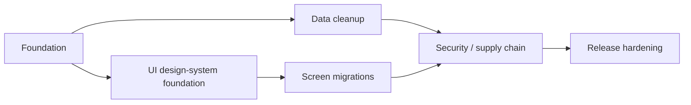

# Repository Hardening Migration Plan

This plan sequences guardrails around the current Kotlin/Compose/Room architecture. It does not authorize automatic Room schema, backup format, enum, or screen rewrites.

| Phase | Goal | Files | Dependencies | Tests | Rollback | Risk | Estimated human engineering effort |
|---|---|---|---|---|---|---|---|
| Foundation | Make source facts, runtime-data invariants, and design tokens cheap PR gates | `scripts/check-*.sh`, `android-quality.yml`, README | Existing Bash/GNU tools | Three guard scripts; unit/lint/build | Revert individual guard commit or temporarily restore last reviewed ratchet | Low | 0.5–1 day |
| Data cleanup | Preserve zero-business-data initialization; decide legacy tombstones explicitly | `AppInitializerInstrumentedTest`, QuickStart ADR, future Room migration | Agent A audit; backup compatibility | Fresh/cleared DB; every migration path; old backup decode | Keep v12 table/DAO and schema-v1 field | Medium | 1–3 days if v13 is approved |
| UI design-system foundation | Ratchet semantic colors/radii and accessibility without banning all dp/sp | Existing design-token guard, theme tokens, semantic tests | Agent B design system | Contract tests; 360/390/412 viewports; 1.3x font; light/dark | Lower only newly introduced ratchets; revert component migration | Low–medium | 1–2 days per screen family |
| Screen migrations | Move screens incrementally onto shared components | `ui/**`, shared components | Design-system foundation | Semantics, bounds, no clipping, reachable interactions | Revert one screen at a time | Medium | 3–8 days |
| Security / supply chain | Verify dependencies and scan dependency/secret drift | verification metadata, dependency review, OSV, Gitleaks | GitHub public-repo features; pinned scanners | Gradle verification; scheduled scan artifacts | Revert metadata separately; keep scans non-PR for service-backed full scans | Medium | 1–2 days plus finding remediation |
| Release hardening | Require full quality gate and verified signed artifacts | reusable quality + release workflows | GitHub environment secrets; API emulators | unit/lint/debug/release, API 24/34/36, `apksigner` | Stop tag publication; preserve last release artifacts | High | 2–4 days plus CI stabilization |



## Change controls

- No `fallbackToDestructiveMigration()`.
- No generated checksum is trusted merely because Gradle emitted it; changes to verification metadata require dependency-diff review.
- OSV full scans are scheduled/manual so an external service outage cannot block ordinary source-only PRs.
- Automatic refactors are limited to dead imports/constants, proven unused dependencies, machine-specific paths, documentation facts, and test utilities.
- A failed test remains failed; no `@Ignore`, disabled tests, `continue-on-error`, or `|| true` is accepted as a gate fix.

## QuickStartPreset dependency report

```text
Models.kt                 QuickStartPreset domain model
Entities.kt               QuickStartPresetEntity / quick_start_presets
Daos.kt                   QuickStartPresetDao
YanjiDatabase.kt          entity + DAO + v5/v6/v9 migration history
BackupModels.kt           schema-v1 quickStartPresets field
BackupTransfer.kt         legacy export/import round-trip
AppInitializer test       verifies the table remains empty at runtime
UI / Repository / Stores  no product consumer
```

The accepted decision is documented in `docs/adr/0001-retain-quick-start-compatibility-tombstone.md`.
