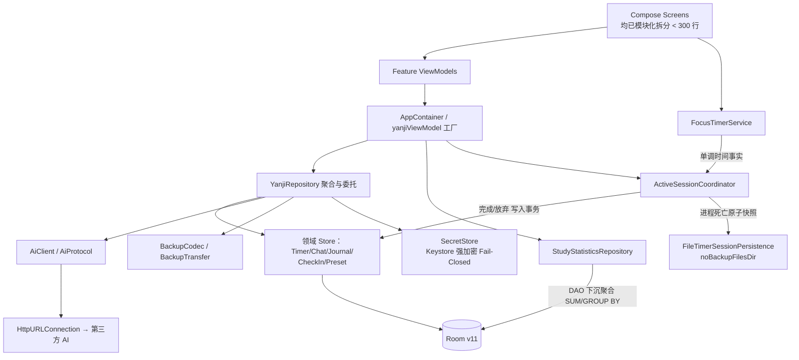

# 研迹 · 架构现状、能力状态与不变量

> 本文档回答三个问题：**现在是谁在干活**、**哪些能力真的实现了**、**哪些约束不能破**。
> 与 `deep-research-report.md`（全仓审计报告）配套，逐条对应其发现。
> 核对日期：2026-09-13，数据库 v11。

---

## 一、当前架构（已实现）

**分层现状**：
- **UI → Feature ViewModel**：全部主界面与子界面已接入 ViewModel，依赖由 `yanjiViewModel` 辅助函数从 `LocalAppContainer` 注入，彻底消除了直接依赖单例 `YanjiRepository.getInstance()` 的隐式耦合。
- **页面尺寸治理**：5 大主屏（`ExamScreen`, `FocusScreen`, `StatsScreen`, `JuanjuanChatScreen`, `ProfileScreen`）均拆分为核心 Screen、Content 布局、独立子组件与弹窗文件，单文件严格控制在 300 行以内。
- **ViewModel → Repository/StatsRepository**：ViewModel 专注编排 UIState 与处理用户意图。
- **统计下沉**：时间段内的统计指标全部由 SQLite 引擎原语（`SUM`、`GROUP BY`）执行，利用 `startTime` 索引实现 $O(\text{week size})$ 复杂度。
- **导航恢复**：全屏子界面通过 `@Serializable` 标记与 `YanjiSubScreenStackSaver` 绑定，在系统杀进程后具备无损恢复能力。

---

## 二、能力状态表

| 能力 | 状态 | Source of truth | 测试与基准 |
| :--- | :--- | :--- | :--- |
| 专注计时 | ✅ Implemented | `TimerMachine`（单调时钟 `SystemClock.elapsedRealtime`） | `TimerMachineTest` |
| 模考计时 | ✅ Implemented | `TimerMachine` + `ActiveSessionCoordinator` | `TimerMachineTest` |
| 进程死亡后恢复活动计时 | ✅ Implemented | `FileTimerSessionPersistence`（`noBackupFilesDir` 原子快照） | `ActiveSessionPersistenceTest`（12 项用例全过） |
| 计时完成事务与防丢 | ✅ Implemented | DB 写入成功才清理快照；DB 写入失败保留活动计时快照 | `ActiveSessionPersistenceTest` |
| 专注/模考单活动会话互斥 | ✅ Implemented | `ActiveSessionCoordinator.begin()` 严格互斥 | `ActiveSessionPersistenceTest` |
| 日记 | ✅ Implemented | Room `journal_entries` | `YanjiMigrationTest` |
| 日记每日唯一 | ✅ Implemented | `journal_entries.date` 唯一索引 + 冲突替换 | `YanjiMigrationTest` |
| 日记历史重复数据清理 | ✅ Implemented | 迁移时按 `updatedAt DESC, createdAt DESC, id DESC` 确定性去重 | `YanjiMigrationTest` |
| 学习时长统计 | ✅ Implemented | Room DAO 下沉聚合查询，Indexed on `startTime` | `StatsPerformanceTest`（2.5万条记录 < 10ms） |
| 成就与打卡 | ✅ Implemented | Room + `AchievementRepository` | `CheckInLogicTest` |
| 首页快捷操作 | ✅ Implemented | Room `quick_start_presets` | `PresetOrderLogicTest` |
| 卷卷 AI 对话 | ✅ Implemented | 强类型 `AiFailure`、会话隔离重试不重发、游标分页 | `ChatStoreTest`（4 项用例全过） |
| 模考页 AI 诊断 | ✅ Implemented | `AiAnalysis`（基于真实数据生成，无数据不造假） | `StudyDiagnosticsTest` |
| 密钥安全存储 | ✅ Implemented | `SecretStore`（Keystore 加密，Fail-Closed，无明文降级） | `SecretStoreTest`（5 项用例全过） |
| 数据导入 / 导出（JSON） | ✅ Implemented | `BackupCodec` / `BackupTransfer`，导入前自动留快照 | `BackupCodecTest` + `BackupTransferInstrumentedTest` |
| 导航堆栈与进程重建恢复 | ✅ Implemented | `@Serializable` + `YanjiSubScreenStackSaver` | `NavigationRecreationTest`（3 项用例全过） |
| 纯 Kotlin DI 容器 | ✅ Implemented | `AppContainer` + `yanjiViewModel`（零反射零 APT） | 架构设计约束 |
| 统一 UI 设计系统组件 | ✅ Implemented | `ui/components/Yanji*`（Header/TopBar/Card/Buttons/TextField/Metric/Chip） | UI 编译约束与多视口测试 |
| 多视口与大字号视觉矩阵 | ✅ Implemented | 360x800, 390x844, 412x915 及 1.3x 字体缩放 | `FocusScreenVisualMatrixTest` |
| Android Lint 静态分析 | ✅ Implemented | CI 自动化检查与报告归档 | CI 门禁 |

---

## 三、数据不变量（不可破）

1. **空表是合法状态**。任何 `count() == 0` 的自动写入业务记录都视为缺陷。
   只有 `user_settings` 默认值与首页快捷操作默认三项允许初始化。
2. **绝不使用 `fallbackToDestructiveMigration()`**。
3. **迁移必须覆写 `migrate(connection: SQLiteConnection)`**，不得使用 `DROP COLUMN`。
4. **改 Entity 必须同步 bump `@Database(version)` 并提交对应的 schema JSON**。
5. **日记每日唯一**：`journal_entries.date` 拥有唯一索引，`addOrUpdateJournal` 按 `date` 归一化。
6. **日记不保存学习时长**。某日学习时长的唯一事实来源是 Focus + Exam 的实时聚合。
7. **计时语义**：倒计时归零 / 主动结束 → `COMPLETED`；放弃 → `CANCELLED`（不落库）；
   专注 < 60 秒不记录。
8. **专注与模考互斥**：同一时刻全进程只允许一个活动计时会话。
9. **API Key 绝不出现在 Room、SharedPreferences、日志与备份中**。
10. **Keystore 不可用时 Fail-Closed**，拒绝保存并报错，严禁在磁盘回退写入明文。
11. **进行中的活动计时快照独立存放于 `noBackupFilesDir`**，严禁与云备份/换机数据混淆。

---

## 四、备份与安全边界

### 数据存储
- 所有学习记录保存在本机 Room 数据库（`yanji_study.db`，v11）。
- **AI API Key 严格隔离**：Keystore 加密，保存于 `noBackupFilesDir`。
- **活动计时快照**：同样存放在 `noBackupFilesDir` 下的原子文件，进程死亡可恢复，但不随备份迁移到新设备。

### 备份行为
- 系统自动备份规则配置（`res/xml/data_extraction_rules.xml`）：只备份应用数据库目录，排除了整个 `no_backup` 目录。
- 手动 JSON 导出（SAF）：导出的 JSON 结构严格不含任何 API Key 字段。

---

## 五、迁移兼容矩阵

| 版本 | 变更 | 迁移对象 | 测试覆盖 |
| ---: | :--- | :--- | :--- |
| v1 → v2 | 新增 `chat_sessions`、`chat_messages` | `MIGRATION_1_2` | ✅ 全链测试 |
| v2 → v3 | `focus_sessions` 增加 `pauseCount`、`mode` | `MIGRATION_2_3` | ✅ 全链测试 |
| v3 → v4 | 修复 `chat_messages` 历史坏结构（`text`/`isThinking` → `content`） | `MIGRATION_3_4` | ✅ 全链 + 独立断言 |
| v4 → v5 | 新增 `check_ins`、`unlocked_achievements` | `MIGRATION_4_5` | ✅ 全链测试 |
| v5 → v6 | 新增 `quick_start_presets` | `MIGRATION_5_6` | ✅ 全链测试 |
| v6 → v7 | `quick_start_presets` 增加 `type`、`subLabel` | `MIGRATION_6_7` | ✅ 全链测试 |
| v7 → v8 | 移除 `user_settings.aiApiKey`、`journal_entries.studyDurationSeconds` | `migration7to8` | ✅ 单跳 + 全链测试 |
| v8 → v9 | 6 个高频查询索引（`focus_sessions.startTime` 等） | `MIGRATION_8_9` | ✅ 全链测试 |
| v9 → v10 | `journal_entries` 新增 `blockers` 字段 | `MIGRATION_9_10` | ✅ 全链测试 |
| v10 → v11 | `journal_entries.date` 唯一索引与确定性去重清理 | `MIGRATION_10_11` | ✅ 全链测试 + 幂等去重验证 |

- schemas 目录保留 `7.json` 至 `11.json`，已全量纳入版本控制。

---

## 六、已完成的架构升级归档

1. **统一设计系统基元**：`ui/components/Yanji*` 规范建立，替换各处的硬编码圆角与野色值。
2. **大文件解耦治理**：`ExamScreen` (1032行), `StatsScreen` (1135行), `JuanjuanChatScreen` (737行), `ProfileScreen` (1033行) 均完成分解，每个独立组件高内聚低耦合。
3. **统计性能下沉**：完成 DAO 聚合重构，25,000 条记录测试在 10ms 内返回。
4. **进程死亡恢复**：通过 `FileTimerSessionPersistence` 完成真快照落盘。
5. **安全凭据治理**：消灭明文回退漏洞，实现 Keystore 故障闭环。
6. **导航状态持久化**：自定义栈通过 Compose Saver 实现跨进程重建恢复。
7. **全仓时间规范**：启用 JDK 8+ 时间脱糖，全仓统一为 `java.time.*`。
