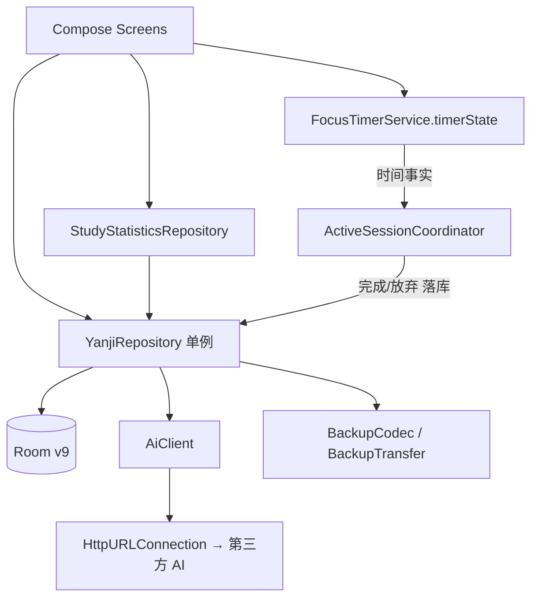
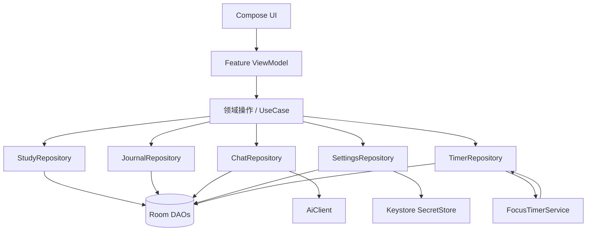

# 研迹 · 架构现状、能力状态与不变量

> 本文档回答三个问题：**现在是谁在干活**、**哪些能力真的实现了**、**哪些约束不能破**。
> 与 `deep-research-report.md`（全仓审计报告）配套，逐条对应其发现。
> 核对日期：2026-09-11，数据库 v9。

---

## 一、当前架构 vs 目标架构

### 当前架构（已实现）

**已知问题（尚未解决）**：`YanjiRepository` 仍是 God Object（约 1700 行），
同时承担数据库绑定、内存缓存、专注业务、模考、日记、设置、聊天、AI 请求与本地 fallback；
UI 直接持有 `YanjiRepository.getInstance()`，没有真正的 Feature ViewModel 层。

### 目标架构（阶段三，未完成）

**这不是「为了 Clean Architecture 而 Clean Architecture」**，要解决的是两个很具体的边界问题：
1. UI 不应该负责决定「一次计时是否完成并落库」——本轮已在计时链路上解决；
2. Repository 不应该同时是数据库缓存、AI Client、业务层和全局状态容器——**待办**。

---

## 二、能力状态表

| 能力 | 状态 | Source of truth | 测试 |
| :--- | :--- | :--- | :--- |
| 专注计时 | ✅ Implemented | `TimerMachine`（单调时钟） | `TimerMachineTest` |
| 模考计时 | ✅ Implemented | `TimerMachine` + `ActiveSessionCoordinator` | `TimerMachineTest` |
| 计时完成落库 | ✅ Implemented（业务层驱动） | `ActiveSessionCoordinator` | ⚠️ 待补集成测试 |
| 专注/模考互斥 | ✅ Implemented | `ActiveSessionCoordinator.begin()` | ⚠️ 待补 |
| 日记 | ✅ Implemented | Room `journal_entries` | `YanjiMigrationTest` |
| 日记每日唯一 | ✅ Implemented（按 date 归一化 id） | `YanjiRepository.addOrUpdateJournal` | ⚠️ 待补 |
| 学习时长统计 | ⚠️ Partial | `StudyStatisticsRepository`（内存聚合，待下沉 DAO） | `StudyDiagnosticsTest` |
| 成就与打卡 | ✅ Implemented | Room + `AchievementRepository` | — |
| 首页快捷操作 | ✅ Implemented | Room `quick_start_presets` | — |
| 卷卷 AI 对话 | ⚠️ Partial（非流式） | `YanjiRepository.callAiApi` | `JuanjuanPromptTest` |
| 模考页 AI 诊断 | ✅ Implemented | `AiAnalysis`（真实数据） | `StudyDiagnosticsTest` |
| AI 网络层 | ✅ Implemented | `data/ai/AiClient` + `AiProtocol` | `AiProtocolTest`（12） |
| 聊天会话 | ✅ Implemented | `data/chat/ChatStore`（Room 为事实来源） | 待补 |
| AI 诊断报告 | ✅ Implemented | `StudyDiagnosticSnapshot` | `StudyDiagnosticsTest` |
| 数据导入 / 导出（JSON） | ✅ Implemented | `BackupCodec` / `BackupTransfer` | `BackupCodecTest` + `BackupTransferInstrumentedTest` |
| Navigation 3 | ❌ Planned migration | `Navigation.kt` 自定义栈 | — |
| 进程死亡后恢复活动计时 | ⚠️ Partial | 内存态 `ActiveSessionCoordinator` | — |
| 空库不写假数据 | ✅ Implemented | `AppInitializer` | `AppInitializerInstrumentedTest` |
| 国际化（i18n） | ❌ Planned | 中文字面量仍散落在源码 | — |
| 覆盖率 / 静态检查 / CI | ❌ Planned | — | — |

---

## 三、数据不变量（不可破）

1. **空表是合法状态**。任何 `count() == 0` 的自动写入业务记录都视为缺陷。
   只有 `user_settings` 默认值与首页快捷操作默认三项允许初始化。
2. **绝不使用 `fallbackToDestructiveMigration()`**。
3. **迁移必须覆写 `migrate(connection: SQLiteConnection)`**，不得使用 `DROP COLUMN`。
4. **改 Entity 必须同步 bump `@Database(version)`**，否则 KSP 会覆盖同版本号的历史 schema JSON。
5. **日记每日唯一**：`addOrUpdateJournal` 按 `date` 归一化 id 与 createdAt。
6. **日记不保存学习时长**。某日学习时长的唯一事实来源是 Focus + Exam 的实时聚合。
7. **计时语义**：倒计时归零 / 主动结束 → `COMPLETED`；放弃 → `CANCELLED`（不落库）；
   专注 < 60 秒不记录。
8. **专注与模考互斥**：同一时刻只允许一个活动计时会话。
9. **API Key 不出现在 Room、SharedPreferences 与日志中**。
10. **AI 运行时上下文不得包含 API Key**（已有测试断言）。

---

## 四、备份与 AI 隐私说明（面向用户）

### 数据怎么存
- 所有学习记录（专注、模考、日记、打卡、成就、快捷操作）保存在本机 Room 数据库。
- **AI API Key 单独保存**：用系统 Keystore 加密后存放在应用的 no-backup 目录。

### 备份会带走什么
- 开启系统「自动备份」时，**只备份学习数据库**（`yanji_study.db`）。
- **凭据永远不会进入备份**：no-backup 目录本身不参与备份，Keystore 密钥不离开本机。
  换机恢复后需要重新填写 API Key。

### 用 AI 时会发送什么
- 只有在用户**主动发起**卷卷对话或生成阶段诊断时才会发起网络请求。
- 发送内容：系统提示词 + 运行时上下文（学习统计、专注/模考记录摘要、日记内容、当前对话）。
- 发送目标：**用户自己配置的 Base URL**。除该地址外不做任何其它上报。
- **不会发送**：API Key 以外的凭据、设备标识、通讯录等任何非学习数据。
- 未配置 Key 时完全离线，走本地知识库回复。

### 网络策略
- 全局禁止明文 HTTP。仅放行本机回环地址（`127.0.0.1` / `localhost` / `10.0.2.2`）。
- 局域网内 HTTP 服务请改用 HTTPS 反向代理，或在电脑上执行
  `adb reverse tcp:<端口> tcp:<端口>` 后把地址填成 `http://127.0.0.1:<端口>/v1`。

---

## 五、迁移兼容矩阵

| 版本 | 变更 | 迁移对象 | 测试覆盖 |
| ---: | :--- | :--- | :--- |
| v1 → v2 | 新增 `chat_sessions`、`chat_messages` | `MIGRATION_1_2` | ✅ 全链测试 |
| v2 → v3 | `focus_sessions` 增加 `pauseCount`、`mode` | `MIGRATION_2_3` | ✅ 全链测试 |
| v3 → v4 | 修复 `chat_messages` 历史坏结构（`text`/`isThinking` → `content`） | `MIGRATION_3_4` | ✅ 全链 + 独立断言 |
| v4 → v5 | 新增 `check_ins`、`unlocked_achievements` | `MIGRATION_4_5` | ✅ 全链测试 |
| v5 → v6 | 新增 `quick_start_presets` | `MIGRATION_5_6` | ✅ 全链测试 |
| v6 → v7 | `quick_start_presets` 增加 `type`、`subLabel` | `MIGRATION_6_7` | ✅ 全链测试 |
| v7 → v8 | 移除 `user_settings.aiApiKey`、`journal_entries.studyDurationSeconds`；明文 Key 抢救到 no-backup 目录 | `migration7to8` | ✅ 单跳 + 全链测试 |
| v8 → v9 | 6 个高频查询索引 | `MIGRATION_8_9` | ✅ 全链测试（索引缺失会导致 schema 校验失败） |

- schemas 目录当前保留 `7.json` / `8.json` / `9.json`。
  v1~v6 的历史 JSON 从未被提交，因此**无法**用 `MigrationTestHelper` 校验中间版本的结构；
  现在的做法是：起点用手写 DDL，终点用真实 schema JSON 校验（见 `YanjiMigrationTest` 注释）。
- `app/schemas/**` 已纳入版本控制（7/8/9 三份），后续每个版本都必须随代码提交并长期保留，
  否则历史可校验性会持续退化。

---

## 五之二、可测试性上的两个「缝」（便于插桩测试不碰真实数据）

1. `AppInitializer`：
2. `data/ai/AiClient` + `AiProtocol`：AI 传输与协议解析独立成类，纯函数部分可被 JVM 单测覆盖。
   Repository 只决定「要不要发请求、失败怎么兜底」；提示词与真实数据由业务层提供。把「首次启动只写系统默认值」这条不变量抽成独立类，
   测试可以对着一次性数据库验证，而不是对着用户的真实库。
   `YanjiRepository.bindDatabase` 委托给它。
3. `BackupTransfer`：把备份的 `collect` / `apply`（整表替换）抽出来，以
   `YanjiDatabase` 作为参数。导入是破坏性操作，直接在 Repository 上测会删掉用户的真实数据；
   现在插桩测试可以传入自己的一次性库。
   这些类都是 `internal`，AGP 的 friend-path 让 `androidTest` 能直接访问。

## 六、真机验证记录（2026-09-11）

设备：OnePlus PKB110 / Android 16（SDK 36）。旧包为 v7 数据库。

| 校验项 | 结果 |
| :--- | :--- |
| 覆盖安装后 `user_version` | 7 → 9 ✅ |
| `room_master_table.identity_hash` | 与 `9.json` 一致 ✅ |
| 各表行数（focus 21 / exam 4 / journal 4 / chat 6 / session 2 / check_ins 8 / 成就 12 / 快捷 1） | 全部保留 ✅ |
| `aiApiKey` / `studyDurationSeconds` 列 | 已移除 ✅ |
| 6 个 v9 索引 | 已建立 ✅ |
| 崩溃 | 无 ✅ |
| 二次启动 | 未重复迁移（幂等）✅ |

> 唯一新增的一行打卡记录来自用户手动点击「打卡」，不是应用自动写入。

### 追加（同日稍晚）：历史假种子数据已清除

| 表 | 清除前 | 清除后 | 说明 |
| :--- | ---: | ---: | :--- |
| `focus_sessions` | 21 | 0 | 全部是 seed（`fs-today-*` / `fs-d1-*` … `fs-d6-*`） |
| `exam_sessions` | 4 | 0 | 全部是 seed（`es-1`~`es-4`） |
| `journal_entries` | 4 | 0 | 全部是 seed（`j-today` / `j-yesterday` / `j-d2` / `j-d3`） |
| `chat_messages` | 6 | 3 | 删 3 条 seed，留 3 条真实消息 |
| `chat_sessions` | 2 | 1 | 删 `session-initial`，留真实会话 |
| `check_ins` | 9 | 4 | 删 09-01~09-05 的 seed，留 09-06/07/08/11 |
| `unlocked_achievements` | 12 | 12 | 保留（无按真实数据重算的机制，见遗留说明） |
| `user_settings` / `quick_start_presets` | 1 / 1 | 1 / 1 | 保留 |

清除后重启应用，各表保持为空 —— "空表是合法状态"这条不变量在真机上再次得到确认。

## 七、剩余工作清单

按「收益 / 风险」排序，均为本轮未完成项。

### 高优先

1. ~~**清理历史假种子数据**~~ ✅ **已在真机上清除（2026-09-11）**
   - 按 seed 的确定性 ID 精确删除：focus 21 / exam 4 / journal 4 / chat_messages 3 /
     chat_sessions 1（`session-initial`）/ check_ins 5（09-01~09-05），共 38 条。
   - 用户真实数据全部保留：1 个真实对话（3 条消息）、4 次真实打卡、12 枚成就、全部设置。
   - 清除后重启应用，**没有再生成任何假数据**（`AppInitializer` 的不变量生效）。
   - 遗留说明：成就的解锁记录是按假数据达成的，`unlocked_achievements` 没有"按真实数据重算"
     的机制，目前保持原样。
2. **拆 `YanjiRepository`（阶段三）**
   - 已完成：`data/ai/AiClient` + `AiProtocol`（网络传输 / 协议解析 / 错误文案）；
     `data/chat/ChatStore`（会话与消息的状态与动作）。`YanjiRepository` 1700 → 1249 行左右。
   - **顺带修掉的 bug**：启动时"当前会话"只在为空时才选，旧数据里残留的 `session-initial`
     会让 UI 停在一个不存在的会话上。现在 `ChatStore.ensureCurrentSessionIsValid()`
     在启动和备份导入后都会校正。
   - **下一步**：`TimerRepository`（把 startFocus/startExamSession/persistCompleted* 与
     lastCompleted* 收进去）→ `StudyRepository` / `JournalRepository` / `SettingsRepository`，
     然后为各 Screen 建 ViewModel。
   - 单 module 内做包级边界即可拿到大部分收益，不必先上多 module。
3. **给 Screen 建 Feature ViewModel**
   - 每个界面暴露一个 `UiState`，Repository 通过构造函数注入，替换
     `repo: YanjiRepository = YanjiRepository.getInstance()` 的默认参数写法。
   - 收益：Composable 可隔离测试；`YanjiRepository` 不再被迫持有所有状态。
4. **统计下沉到 DAO**
   - 目前 `StudyStatisticsRepository` 仍基于内存列表反复扫描。
   - 需要新增 `StatsDao`：按日期/科目区间的 `SUM`、`GROUP BY` 聚合查询，直接组合成 Flow。
5. **进程死亡后恢复活动计时**
   - 新增 `active_timer_sessions` 单行表（含 `TimerSnapshot` 字段），
     `ActiveSessionCoordinator` 在 begin/update 时落库，启动时 `restorePersisted()` 读回。
   - 注意 `elapsedRealtime` 在设备重启后会归零，恢复时需以 `accumulatedActiveMs` 为准。

### 中优先

7. **继续补插桩测试**（已从 0 起步到 9 个用例）
   - 已完成：导出/导入往返、空库不写假数据、"删空后重启仍为空"。
   - 待补：后台倒计时结束时确实落库；通知「结束」= 完成；互斥拒绝；
     Activity 重建 / 进程死亡后的活动计时恢复；导入过程中途失败的事务回滚。
8. **接入覆盖率与静态检查**
   - Kover/JaCoCo 先设可达 baseline，再逐步提高 core domain/data 分支覆盖。
   - Detekt/Ktlint 先跑起来记录存量问题，再开 ratchet（禁止新增 warning），
     不要一步 `warningsAsErrors = true` 把构建打红。
9. **API 24 / 28 / 33 / 36 模拟器矩阵**
   - 重点验证 `SQLite` 迁移行为、前台 Service 类型、通知渠道、进程恢复。
10. **清理疑似 dead code**
   - `DurationFormatter.formatDetailed`、`StudyStatisticsRepository.getFocusSessionDetail/getExamSessionDetail`、
     `Subject.toComposeColor`、`YanjiRepository.updateFocusDuration`、
     DAO 的 `getBySessionId`/`getLatest` 等。需在 IDE/编译器引用检查通过后删除。
11. **业务枚举去中文**
   - `FocusModes` 与 `FocusSessionEntity.mode` 目前存中文展示值（`"正向计时"`）。
     应改为稳定 ID（`COUNT_UP`），UI 通过 string resource 映射，
     否则改文案等于改持久化协议。

### 低优先

12. **国际化**：`strings.xml` 目前只有 app 名称，大量中文硬编码在源码里。
13. **文档同步**：`DESIGN.md` 描述的若干交互仍需逐条与实现对齐。
14. **AI 流式输出**：当前读取完整 JSON response，不是真流式。
15. **构建编码**：`gradle.properties` 的 `-Dfile.encoding=GBK` 应下沉为开发机文档，
    CI 使用 UTF-8 + ASCII-safe 路径。
